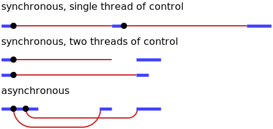
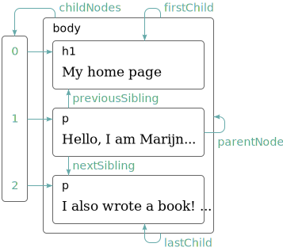

# Apuntes Javascript

-------------------------------------------------------------------------------

> Eloquent Javascript (3rd edition, 2019), Marijin Haverbeke

-------------------------------------------------------------------------------

## Convenciones Javascript

### Indentación

    Indentación:    2 espacios.
    Indentación:    4 espacios.

### Comentarios

    // Comentario de una línea.
    /* Comentario de varias líneas. */

### Nombres

    Variable:       carSpeed
    Constante:      CAR_SPEED
    Función:        carSpeed()
    Constructor:    Number()

-------------------------------------------------------------------------------

> - Tanto el símbolo `$` como `_`, están permitidos en la declaración de
>   bindings (variables).
> - Aquellos propiedades cuyo nombre inicia con el símbolo `_`, son entendidos
>   como valores internos que no deben manipularse de manera directa.

-------------------------------------------------------------------------------

### Paso por valor y referencia

    Variables:      valor.
    Objetos:        referencia.

-------------------------------------------------------------------------------

> - Las comas son opcionales; pero en algunos casos son requeridos para indicar
>   el cuerpo de una sentencia, de modo que es recomendable usarlos.
> - Javascript es asíncrono y no bloqueante y un *event loop* o loop de eventos
>   de un solo thread.
> - Se detalla más en la sección de *event loop*.

-------------------------------------------------------------------------------

### Variables

Las variables se puede declarar tanto con `let` como con `var`:

```js
if (...) {
    let letNumber = 10;
    var varNumber = 11;
}

console.log(letNumber);     // Undefined.
console.log(varNumber);     // 11;
```

-------------------------------------------------------------------------------

> - `let` y `const` son locales al bloque en el que fueron declarados.
> - `var` es visible en toda la función que la contiene o todo el archivo, si
>   es el caso; además permite invocarse antes de declararse, redeclararse
>   nuevamente y *crear propiedad de objeto global*.
> - `let` y `const` fueron introducidos en la es6 o es2015.

-------------------------------------------------------------------------------

#### El entorno

Cuando un programa inicia, por ejemplo el browser, se carga consigo una serie
de variables y funciones parte del lenguaje, que permiten interactuar con el
sistema subyacente y dispositivos como el mouse o el teclado.

-------------------------------------------------------------------------------

> - A la colección de bindings y sus valores que existen en un tiempo dado, se
>   le conoce como *environment* (entorno).
> - Funciones como `setTimeout`, `DOM` o HTTP requests no forman parte del
>   runtime de JavaScript, sino que son *web apis* que provee el navegador.

-------------------------------------------------------------------------------

## Part I: language

### 1. Values, Types, and Operators

#### 1.1 Números

```js
var number = 10;    // Antes del 2015.
let number = 10;    // A partir del 2015.
```

> Tipos especiales de números: `-Infinity`, `Infinity` y `NaN` (not a number).

#### 1.2 Strings

```js
let text = "Lie on the ocean"
let text = 'Float on the ocean'
let text = `Down on the sea`
```

> Este último, también llamado *template literals*, no necesita declarar los
> saltos de línea `\n` para crearlos y permite anidar variables a diferencia de
> los otros dos:
> `Hello, ${name}` (string entre backticks).

Obteniendo substrings de una cadena:

```js
let name = "John Doe";

console.log(name.slice(1,3));           // oh
console.log(name.substr(2,3));          // 'ohn '
console.log(name.substring(2,3));       // h
```

-------------------------------------------------------------------------------

> - El método `slice` puede aceptar valores negativos que se cuentan desde el
>   final, su notación de intervaloes es `[)`.
> - El método `substr` recibe los  siguientes parámetros: `substr(start,
>   length)`.
> - El método `substring` recibe los argumentos `substring(start, end)`;
>   notación de intervalos tipo `[]`;

-------------------------------------------------------------------------------


Retornar el valor de un índice dado:

```js
console.log(name.charAt(0));            // valor en el índice 0.
```

> En lugar de `charAt` también se puede utilizar `name[0]` que es más moderno.

Buscar coincidencias con `startsWith` y `endsWith`:

```js
console.log(name.startsWith("Jo"));     // True
console.log(name.endsWith("xyz"));      // False
```

Buscar coincidencias con `indexOf` o `lastIndexOf`:

```js
console.log(name.indexOf('h'));         // Índice del substring 'h'.
console.log(name.lastIndexOf('h', 4));  // Búsqueda de 'h' desde el índice 4.
```

> El método `indexOf` o `lastIndexOf` de una cadena, puede buscar un substring
> que contenga más de un caracter, a diferencia de un arreglo, donde solo se
> puede buscar un elemento.

Buscar coincidencias con `indexOf` o `lastIndexOf` (operador NOT a nivel de
bits):

```js
console.log(~2)   \\ -(2+1)             // -3
console.log(~1)   \\ -(1+1)             // -2
console.log(~0)   \\ -(0+1)             // -1
console.log(~-1)  \\ -(-1+1)            // -0

if(~name.indexOf("Jo"))                 // Posición de la subcadena.
    console.log("Found it!");
```

> Truco a nivel de bits que se usa para resolver el inconveniente con `indexOf`
> que devuelve `0` (false) si el substring se ubica al principio.

Buscar coincidencias con `includes`:

```js
console.log(name.includes("Jo", 2)      // Busca a partir del índice 2.

if(name.includes("Jo")                  // True/False
    console.log(Found it!");
```

> Devuelve `true/false` dependiendo de si existe el substring o no.

Separar/Unir cadenas:

```js
name = "John Doe Doe";

name.split(' ');                        // ["John", "Doe", "Doe"]
name.join('.');                         // "John.Doe.Doe"
```

Otros métodos útiles:

```js
name.trim()                             // Elimina espaciones en blanco.
name.repeat(3);                         // Repite n veces el string.
console.log(String(7).padStart(3, '0')  // Imprime 7 con 3 ceros a la izq.
```

Retornar el código de un caracter en una posición dada:

```js
console.log("z".codePointAt(0));        // 122
console.log("Z".codePointAt(0));        // 90

Obtener el valor de un caracter dado:

```js
console.log(String.fromCodePoint(90));  // Z
```

-------------------------------------------------------------------------------

> - Los datos textuales son almacenados como cadenas, no existen tipos
>   separados para un solo carácter.
> - El formato interno de una cadena es de tipo UTF-16 y no está vinculado a la
>   codificación de la página.
> - Los caracteres de "escritura" utilizan una unidad de código, mientras que
>   que un emoji, dos. Esto hace que `charCodeAt` no muestre el código completo
>   del caracter.
> - El bucle `for/of` devuelve caracteres reales, no unidades de código.

-------------------------------------------------------------------------------

#### 1.3 Booleanos

Signos de comparación: `<, >, <=, >=, != e ==`.

```js
console.log("Aardvark" <= "Zoroaster")
console.log(NaN == NaN)
```

> `NaN` es el resultado de una computación absurda, por lo que su comparación
> siempre es `false`.

Operadores lógicos disponibles: `and`, `or` y `not` como `&&`, `||` y `!`.

```js
console.log(false or true)
console.log(1 + 1 == 2 && 10 * 10 > 50)
```

> En el último caso, la precendencia es el siguiente (menor a mayor): `||`,
> `&&`, `operadores de comparación` y el resto.

#### 1.4 Operador ternario

```js
console.log(true ? 1 : 2)
```

#### 1.5 Valores vacíos

Valores pero que no contienen información: `null` y `undefined`.

> La diferencia de significado entre ambos valores es un error de diseño de
> Javascript; tratarlos, en la mayoría de los casos, como intercambiables.

#### 1.6 Conversión automática de tipos

Conversiones automáticas que permiten operaciones raras:

```js
console.log(8 * null)       // 0
console.log("5" - 1)        // 4
console.log("5" + 1)        // 51
console.log("five" * 2)     // NaN
console.log(false == 0)     // true
```

-------------------------------------------------------------------------------

> - A la conversión implícita de tipos de datos que realiza Javascript, se le
>   denomina como *type coercion* o coerción de tipos.
> - Para evitar la conversión automática de tipos en la comparación de valores,
>   se puede usar el operador `===` o `!==`.

-------------------------------------------------------------------------------

Para valores de diferentes tipos, los operadores `OR` y `AND` convierten el
valor izquierdo en booleano para decidir que hacer posteriormente.

- Cortocircuito de operadores lógicos (OR):

```js
console.log(null || "user")         // user
console.log("Agnes" || "user")      // Agnes
console.log(0 || 3)                 // 3
```

-------------------------------------------------------------------------------

> - El operador `OR` intenta devolver el valor `true`, basandose únicamente en
>   la comprobación del valor izquierdo.
> - En la conversión de números y strings a booleano, los valores `0, NaN` y
>   `""` cuentan como `false`.

-------------------------------------------------------------------------------

- Cortocircuito de operadores lógicos (AND):

```js
console.log(null || "user")         // null
console.log("Agnes" || "user")      // user
console.log(0 || 3)                 // 0
```

> El operador `AND` intenta devolver el valor `false`, basandose únicamente en
> la comprobación del valor izquierdo (contrario al `OR`).

### 2. Program structure

#### 2.1 Variables y constantes

Crear variables o enlaces con `let`:

```js
let one = 1, two = 2;
console.log(one + two);             // 3
```

> Es preferible imaginar los enlaces o variables como tentáculos que sujetan
> valores, en lugar de cajas que los contienen.

Crear variables o enlaces con `var`:

```js
var $name = "Ayda";
var greeting = "Hello ";

console.log(greeting + $name);
```

Crear constantes:

```js
const PI = 3.14;
```

Desempacar valores de arreglos en variables (destructuring):

```js
let [a, b, ...numbers] = [10, 20, 30, 40, 50];

console.log(a);                             // 10
console.log(b);                             // 20
console.log(numbers);                       // [30, 40, 50]
```

-------------------------------------------------------------------------------

> - Se puede asignar a una variable un valor predeterminado si el valor
>   desempacado es `undefined`: `[a=0, b=0] = [1]`.
> - También se puede utilizar para intercambiar valores: `[a, b] = [b, a]`.

-------------------------------------------------------------------------------

Desempacar valores de objetos en variables (destructuring):

```js
let a, b, numbers;

({data, a, d} = {a: 10, b: 20, data: 30, d: 40});
console.log(a);                                     // 10
console.log(d);                                     // 40
console.log(data);                                  // 30
```

> Asignar nombres a nuevas variables: `const {a: aa, b: bb} = {a: 10, b: 20}`,
> ahora quienes tienen los valores `10` y `20` son las variables `aa` y `bb`.

Desempacar valores de retorno de funciones (destructuring):

```js
function f() {
    return [10, 20];
}

let [a, b] = f();
```

> Para ignorar algunos o todos los valores de retorno: `[a,,b] = f()` en caso
> `f()` retornase más de 2 valores.

-------------------------------------------------------------------------------

> - Posibilidades de la desestructuración:
> - ~utilizarlo como parámetros de una función.~ (*ver funciones*)
> - utilizarlo como parámetros de una función y con valores por defecto.
> - Desempaquetar valores de una arreglo/objeto anidado.
> - Utilizar `for/of` para desempaquetar solo ciertos valores.
> - Se puede desestructurar de manera combinada arreglos y objetos.

Nota: Este apartado será ampliado posteriormente dependiendo de la necesidad y
frecuencia de uso de las "posibilidades".
    
-------------------------------------------------------------------------------

#### 2.2 Condicionales

Condicional `if-else`:

```js
if (num < 10) {
    console.log("Small");
} else if (num < 100) {
    console.log("Medium");
} else {
    console.log("Large");
}
```

Condicional `switch`:

```js
switch (prompt("What is the weather like?")) {
    case "rainy":
        console.log("Remember to bring an umbrella");
        break;
    case "sunny":
        console.log("Dress lighty");
        break;
    case "cloudy":
        console.log("Go outside");
        break;
    default:
        console.log("Unknown weather type!");
        break;
}
```

#### 2.3 Bucles

Bucle `while`:

```js
while (i <= 10) {
    console.log(i);
    i++;
}
```

Bucle `do...while`:

```js
do {
    console.log(i);
    i++;
} while (i <= 10)
```

Bucle `for`:

```js
for (let i=0; i < 10; i++) {
    if(x == 5)
        break;          // Sale del bucle.
    if(x == 6)
        continue;       // Continua con la siguiente iteración.

    console.log(x);
}
```

-------------------------------------------------------------------------------

> - También es posible salir de un bucle con la sentencia `break`.
> - La sentencia `continue` interrumpe la ejecución para continuar con la
>   siguiente iteración.

-------------------------------------------------------------------------------

Bucle for y arreglos u objetos:

```js
for (let i=0; i < array.length; i++) {
    console.log(i);
}
```

Bucle `for/of`:

```js
for (let value of array) {
    console.log(value);
}
```

-------------------------------------------------------------------------------

> - El bucle `for/of` solo puede iterar sobre objetos iterables: aquellos que
>   implementan `Symbol.iterator`.
> - Son objetos iterables: arrays, maps, nodelists y hasta strings, que también
>   cuentan con índice y *length* (un object no es iterable).
> - Permite acceder al valor, mas no a los índices.

-------------------------------------------------------------------------------

Bucle `for/in`:

```js
for (let value in array) {
    console.log(array[value]);
}
```

-------------------------------------------------------------------------------

> - Como los arreglos son una tipo especial de objetos, es posible que el
>   iterador `for/in` itere a través de todas las propiedades del arreglo y
>   no tan solo de los númericos.
> - El iterador `for/in` está optimizado para objetos génericos pero no para
>   los arreglos, por lo que es 10-100x más lento.

-------------------------------------------------------------------------------

### 2. Funciones

Declaración de función:

```js
console.log(square(3));

function square (x) {
    return x * x;
}
```

> La declaración de función puede no formar parte del flujo de control regular.

Arrow functions (funciones de flecha):

```js
const power = (x) => {return x * x; };  // Forma regular.
const power = x => x * x;               // Forma corta.
const print = () => {...};              // Sin parámetros.
```

> La palabra `function` es reemplazado por la flecha `=>`.

Función como constante:

```js
const square = function(x) {
    return x * x;
};
```

Función  como valor:

```js
let launchMissiles = function() {
    missileSystem.launch("now");
};

if(safeMode) {
    launchMissiles = function () {...};
}
```

Anidamiento de funciones: 

```js
const hummus = function(factor) {
    const ingredient = function(amount, unit, name) {
        ...
    };
};
```

Llamando a una función con argumentos extra:

```js
function square(x) { return x * x; }
console.log(square(8, true, "hello"));      // 64
```

> Los argumentos restantes son ignorados y si hay parámetros faltantes, a este
> se le asigna el valor `undefined`.

Función con argumentos por defecto:

```js
function power(base, exponent = 2) {
    ...
}
```

Verificar parámetro omitido, nulo, undefined o vacío de una función:

```js
function showMessage(text) {
    text = text || "empty";
}
```

Verificar parámetro `undefined` o `null` mediante el *operador de fusión null*
(nullish coalescing operator):

```js
let user;
console.log(user ?? "empty");                   // empty 
```

-------------------------------------------------------------------------------

> - Esta funcionalidad es reciente (~2020), por lo que no esta soportado por
>   todos los navegadores.
> - El *operador de fusión null* se puede usar tantas veces como sea necesario:
>   `(value1 ?? value2 ?? value3)`.
> - También se puede usar `||` del mismo modo que con `??`, la diferencia está
>   en que `||` no distingue una variable vacía o con valor 0 de `undefined` o
>   `null`.

-------------------------------------------------------------------------------

Función con un indeterminado número de argumentos (rest arguments):

```js
function max(...numbers) {
    let result = -Infinity;
    for (let number of numbers) {
        if (number > result) result = number;
    }
    return result;
}

console.log(max(4, 1, 9, -2, 11, 3));   # 11
```

> Las funciones de este tipo, vinculan los argumentos en un arreglo, por lo que
> es posible crear un arreglo de números y utilizarlos de la siguiente manera:
> `max(4, ...numbers, 8)`.

Función con un *destructing* como parámetro:

```js
// Normal
function phi(table) {
    return (table[3] * table[0] - table[2] * table[1]) /
        Math.sqrt((table[2] + table[3]) *
                  (table[0] + table[1]) *
                  (table[1] + table[3]) *
                  (table[0] + table[2]));
}

// Destructuring
function phi([n00, n01, n10, n11]) {
    return (n11 * n00 - n10 * n01) /
        Math.sqrt((n10 + n11) * (n00 + n01) *
                  (n01 + n11) * (n00 + n10));
}
```

> - Todas las funciones son métodos de objetos y casi todo en Javascript son
>   objetos, a excepción de algunos datos primitivos.
> - Ambas funciones hacen lo mismo, con la diferencia que el último simplifica
>   el acceso a los valores del arreglo mediante variables `n00, n01, n10, n11`
>   que *desempacan* los valores de cada uno de los índices.

#### 2.1 Closure

Oh, malditos closures!

```js
function multiplier(factor) {
    return number => number * factor;
}

let twice = multiplier(2);
console.log(twice(5));                  // 10
```

-------------------------------------------------------------------------------

> - Un closure es: una función anidada dentro de otra y que, después de
>   finalizado la función contenedora, la función contenida aún pueda operar
>   con el entorno de la función padre (o algo asi?).
> - Como no es posible acceder a la función anidada, es necesario almacenar la
>   funcion contenedora como valor de una variable o constante. Además, la
>   función contenida debe ser el `return` de la función padre.
> - La función padre puede ser una fábrica de funciones.
> - Muchas funciones anidadas pueden compartir el mismo entorno de la función
>   contenedora.
> - Los `closures` permiten proteger el acceso a las variables, similar a los
>   métodos privados de Java que solo pueden ser invocados por los métodos de
>   la misma clase. La carencia de encapsulamiento de Javascript, permite a los
>   `closures`, ser la mejor opción para este tipo de propósitos.
> - Es importante identificar las situaciones de uso de los `closures` en favor
>   del rendimiento (los closures suelen consumir muchos recursos).
> - Casi todo en Javascript gira en torno a las flexibilidad de las funciones.
> - No se que tanto tenga que ver, pero Javascript utiliza funciones como
>   clases.

-------------------------------------------------------------------------------

#### 2.2 Recursividad

```js
// simple example:
function power(base, exponent) {
    if (exponent == 0)
        return 1;
    else
        return base * power(base, exponent - 1);
}

/* Given a number, tries to find a sequence of additions and multiplications
 * (5,3) 
*/
function findSolution(target) {
    function find( current, history) {
        if (current == target) {
            return history;
        } else if (current > target) {
            return null;
        } else {
            return find(current + 5, `(${history} + 5`)
            || find(current * 3, `${history} * 3)`);
        }
    }
    return find(1, "1");
}

console.log(findSolution(28));
```
```
(((1 + 5 * 3) + 5 + 5))
```

> Es necesario distinguir la importancia de la elegancia vs la velocidad.

### 4. Data Structures: Objects and Arrays

#### 4.1 Arreglos

+ Crear arreglo:

```js
let array1   = new Array("one", 2, "three", 4, "five");
let array1   = ["one", 2, "three", 4, "five"];

console.log(array1[2]);                                  // 'three'
```

> Si `new Array()` recibe un solo argumento, este es la longitud del arreglo.

+ Agregar/Quitar elementos del arreglo (stack):

```js
array1.push("six")       // Agregar nuevo elemento al final.
array1.pop()             // Quita y retorna el último elemento.
```

+ Agregar/Quitar elementos del arreglo (queue):

```js
array1.unshift("six")    // Agrega nuevo elemento al principio.
array1.shift()           // Quita y retorna el primer elemento.
```

-------------------------------------------------------------------------------

> - Es posible agregar múltiples elementos tanto con `push()` como con
>   `unshift()`.
> - `push/pop` se ejecutan más rápido que `unshift/shift`.

-------------------------------------------------------------------------------

+ Buscar un valor especificado:

```js
let names = ["John", "Edward", "Peter", "Sue"];

console.log(names.indexOf("Peter"));            // 2
console.log(names.lastIndexOf("Peter"));        // 2
```

-------------------------------------------------------------------------------

> - El método `lastIndexOf()` busca desde el final hasta el principio,
>   contrario a `indexOf()`.
> - También se puede ingresar un segundo argumento que indique desde que índice
>   comenzar a buscar.
> - Si el valor no es encontrado, devuelve `-1` o bien el índice del valor.

-------------------------------------------------------------------------------

+ Mostrar elementos dentro de un rango determinado:

```js
array.slice(1, 4);
```

> En notación de intervalos sería: `[)` (cerrado, abierto).

+ Invertir el orden de los elementos del arreglo:

```js
let array = [1, 2, 3, 4, 5, 7];
array = array.reverse();
```

+ Concaternar arreglos:

```js
array2.concat(array.slice(2, 3));
```

> Si no se le pasa a `concat` un argumento de tipo arreglo, este agrega el
> elemento al nuevo arreglo. 

+ *Esparcir* el contenido de un arreglo dentro de otro:

```js
let numbers = [1, 2, 3];
let values = ['a', ...numbers, 'b'];    // ['a', 1, 2, 3, 'b']
```

> A esto también se le conoce como notación de triple punto y su uso está
> relacionado con las funciones que reciben argumentos indeterminados.

+ Arreglo multidimensional:

```js
// Matriz:
let matrix  = [
    [1, 2, 3],
    [4, 5, 6]
];

console.log(matrix[0][1]);      // 2
```

+ Cosas raras que se pueden hacer con un arreglo:

```js
array.name = "Esther";      // Crea una propiedad.
array[99] = "value";        // Indice mayor que la longitud.
array.length = 7;           // length es editable.
```
-------------------------------------------------------------------------------

> - Los elementos de un arreglo son almacenados como propiedades que usan
>   números como nombres de propiedad. En el fondo siguen siendo objetos que
>   pueden comportarse como tal y echar a perder la optimización de datos
>   contiguos.
> - Casi todos los valores tienen propiedades en Javascript, a excepción de
>   `null`.
> - Se puede acceder a las propiedades de los valores mediante la notación de
>   punto o corchete: `array.length` o `array["length"]`.
> - La propiedad `length` es el valor del índice más uno, mas no los elementos
>   dentro del objeto o arreglo.
> - A las propiedades que contiene funciones se les conoce como métodos del
>   valor al que pertenecen: `name.toUpperCase()`.

-------------------------------------------------------------------------------

#### Objetos

Crear objetos:

```js
let obj = new Object();                                 // Empty obj (cnstrctr)
let obj = {};                                           // Empty obj (obj. lit)

let obj   = {name: "John", lastName: "Doe", age: 38,};
const obj = {name: "John", lastName: "Doe", age: 38,};
```

-------------------------------------------------------------------------------

> - Existen muchas maneras de crear objetos en Javascript, dada su definición.
> - Los objetos solo pueden tener *keys* de tipo *string* o *symbol*; si son
>   números, se realiza una coerción automática.
> - Los objetos definidos con `const` solo pueden modificarse mediante la
>   notación de punto o corchete.
> - Es posible dejar una coma al final de la última propiedad para facilitar
>   agregar/eliminar/mover propiedades; a esto se le llama *trailing/hanging
>   comma*.

-------------------------------------------------------------------------------

Crear objetos con propiedades calculadas (computed properties):

```js
let fruit = prompt("bla bla bla");

// Simple:
let obj = {
    [fruit]: 10
}
// Complejo:
let obj = {
    [fruit + "computers"]: 10
}
```

> El valor de `fruit` será el que el usuario ingrese o el valor que se haya
> definido.

Objeto con nombre de propiedad de varias palabras:

```js
let obj = {
        name: "John",
        age:  32,
        "card number": "111-222-3333"
    }
```

> Para acceder a este tipo de propiedad se usa la *notación de corchetes*:
> `obj["card number"]`.

Acceder a las propiedades de un objeto:

```js
...

console.log(obj.name)                               // John
console.log(obj["name"])                            // John
```

> La notación de corchete puede ser usado para permitir al usuario ingresar el
> nombre de la clave de un objeto.

+ Devolver un objeto en una función:

```js
function makeUser(name, age) {
    return {
        name: name,
        age: age
    };
}
```

> Es posible omitir `name: name` y en su lugar usar simplemente `name` o usar
> ambas formas.

+ Borrar elementos de un objeto:

```js
delete obj.age
console.log(obj.age)                                // Undefined
```

> Si la propiedad no existe, Javascript no muestra ningun error, en su lugar
> retorna `undefined`.

+ Verificar si existe la propiedad especificada del objeto:

```js
console.log("property" in obj);                     // True/False
```

> También se podría utilizar comparaciones con `undefined` para saber si una
> propiedad existe; pero a diferencia de `in`, este no funciona cuando el valor
> almacena `undefined`.

+ Mostrar las *keys* de un objeto:

```js
console.log(Object.keys(obj));                      // Devuelve un arreglo.
```

+ Copiar las propiedades de un objeto dentro de otro:

```js
Object.assign(obj1, obj2);                          // obj1 ← obj2
```

-------------------------------------------------------------------------------

> - Es posible utilizar las palabras reservadas del lenguaje para el nombre de
>   las propiedades de un objeto, tales como: `for: 3`, `return: 3`, `let:
>   3`...
> - Los comparadores aplicados a objetos comparan el objeto en sí, mas no el
>   contenido, sea el operador `==` o `===`.

-------------------------------------------------------------------------------

#### JSON

Convertir un arreglo/objeto a JSON:

```js
let object = {
    name: "John",
    age: 30,
    isAdmin: false,
    courses: ["html", "css", "js"],
    wife: null
}

let json = JSON.stringify(object);  // Devuelve un string codificado en JSON.
```

> Es posible serializar cualquier casi cualquier tipo de dato: objects, arrays,
> strings, numbers, boolean e incluso `null`.

Convertir de JSON a arreglo/objeto:

```js
...

let object = JSON.parse(json);
```
-------------------------------------------------------------------------------

> - El nombre de las propiedades deben estar entre comillas dobles.
> - No se permiten comentarios, funciones anidadas, claves simbólicas ni
>   valores `undefined`.
> - Si se desea enviar los datos de un ordenador a otro, es necesario realizar
>   una serialización de los datos.
> - JavaScript Object Notation (notación de objeto de JavaScript).
> - Utilizado ampliamente como formato de comunicación y almacenamiento en la
>   web.

-------------------------------------------------------------------------------

### 5. Higher-Order Functions

Una función que toma otra función como argumento o la retorna como resultado, se
denomina *higher-order function* o función de alto nivel. Estas permiten
abstraer tanto sobre valores como acciones y son ampliamente utilizados en el
procesamiento de datos (`map`, `filter` y `reduce`).

#### Abstracting Repetition

Función que repite `n` veces una función pasada como argumento:

```js
function repeat(n, action) {
    for (let i=0; i < n; i++)
        action(i);
}

repeat(3, console.log);

// → 0, 1, 2
```

Función que repite `n` veces una función creada en el espacio del argumento:

```js
.
.
.

let labels = [];

repeat(3, i => {labels.push(`Unit ${i}`)});
console.log(labels);                    

// → 'Unit 0', 'Unit 1', 'Unit 2'
```

-------------------------------------------------------------------------------

> - La programación funcional abstrae el código imperativo (en este caso un
>   bucle) y la hace declarativo (más fácil de entender).
> - Al uso de una función como argumento, se le conoce como `callbacks`.

-------------------------------------------------------------------------------

#### Filtering Arrays

Definiendo una función `filter`:

```js
function filter(array, test) {
    let passed = [];
    for(let element of array) {
        if(test(element))
            passed.push(element);
    }
    return passed;
}

console.log(filter(SCRIPTS, e => e.living));

// → [{name: "Adlam", ...}, ...]
```

> La función `filter` de JavaScript, recibe 4 argumentos: valor actual, índice,
> array y valor a utilizar com `this`.
> El dataset que se está utilizando es `SCRIPTS` y está disponible en
> [eloquentjavascript](https://eloquentjavascript.net/code/#5).

#### Transforming with map

```js
function map(array, transform) {
    let mapped = [];

    for(let element of array)
        mapped.push(transform(element));

    return mapped;
}

let rltScripts = SCRIPTS.filter(s => s.direction == "rtl");
console.log(map(rtlScripts, s => s.name));                  

// → ["Adlam", ...]
```

> Parámetros de la función `map` de JavaScript: valor actual, índice, array y
> valor a usar como `this`.
> La función `filter` usada con `SCRIPTS` es la función implementada por
> JavaScript, más no la que ha sido creada anteriormente.

#### Summarizing with reduce

```js
function reduce(array, combine, start) {
    let current = start;
    
    for(let element of array)
        current = combine(current, element);
    
    return current;
}

let array = [1, 2, 3, 4];
console.log(reduce(array, (a, b) => a + b, 0));

// → 10
```

> La función `reduce` propia de JavaScript, recibe 4 argumentos: acumulador,
> valor actual, índice actual y array.

#### Composability

Composición de funciones:

```js
// Dado un código de caracter, devuelve el script al que pertence:
function characterScript(code) {
    for(let script of SCRIPTS) {
        if(script.ranges.some(([from, to]) => {
            return code >= from && code < to;
        })) {
            return script;
        }
    }
    return null;
}

console.log(characterScript(121));
// → {name: "Latin", ...}

// Cuenta la cantidad de elementos encontrados en un grupo:
function countBy(items, groupName) {
    let counts = [];

    for(let item of items) {
        let name = groupName(item);
        let known = counts.findIndex(c => c.name == name);
        if(known == -1) {
            counts.push({name, count: 1});
        } else {
            counts[known].count++;
        }
    }
    return counts;
}

console.log(countBy([1, 2, 3, 4, 5], n => n > 2));
// → [{name: false, count: 2}, {name: true, count: 3}]

// Indica el script que se utiliza en un fragmento de texto:
function textScripts(text) {
    let scripts = countBy(text, char => {
        let script = characterScript(char.codePointAt(0));
        return script ? script.name : "none";
    }).filter(({name}) => name != "none");

    let total = scripts.reduce((n, {count}) => n + count, 0);
    if(total == 0) return "No scripts found";

    return scripts.map(({name, count}) => {
        return `${Math.round(count * 100 / total)} % ${name}`;
    }).join(", ");
}

console.log(textScripts(英国的狗说"woof", 俄罗斯的狗说"тяв"'));
```
```
61% Han, 22% Latin, 17% Cyrillic
```

### 6. The Secret Life of Objects 


#### Encapsulation

> - JavaScript no proporciona todavía formas de distinguir propiedades públicas
>   de privadas y evitar que código externo acceda a las privadas.
> - Es común utilizar el símbolo `_` al principio del nombre de una propiedad
>   para indicar que es privada.

#### Methods

Los métodos son propiedades que almacenan funciones:

```js
let rabbit = {};
rabbit.speak = function(line) {
    console.log(`The rabbit says "${line}"`);
};

rabbit.speak("I'm alive.");

// → The rabbit says "I'm alive."
```

Accediendo a la propiedad del objeto desde el método con `this`:

```js
function speak(line) {
    console.log(`The ${this.type} rabbit says "${line}"`);
}

let whiteRabbit = {type: "white", speak};
let hungryRabbit = {type: "hungry", speak};

whiteRabbit.speak("Oh my ears and whiskers!");
hungryRabbit.speak("I could use a carrot right now.");

// → The white rabbit says "Oh my ears and whiskers!"
// → The hungry rabbit says "I could use a carrot right now."
```

-------------------------------------------------------------------------------

> - La keyword `this` hace referencia a un objeto y depende del contexto.
> - La keyword `this` en el cuerpo del método, automáticamente hace referencia
>   al objeto sobre el que se llamó.
> - En una función referencia al objeto global y en `strict mode`, `undefined`.
> - En un evento, al elemento que lo recibe.
> - `this` no es una variable por que no se puede cambiar su valor.

-------------------------------------------------------------------------------

Accediendo a la propiedad del objeto de manera explícita:

```js
...

speak.call(hungryRabbit, "Burp!");

// → The hungry rabbit says "Burp!"
```

-------------------------------------------------------------------------------

> - La funcion `call` permite llamar a un método con el objeto propietario como
>   argumento: `<method>.call(object)` permitiendo, además, utilizar el
>   método de otro objeto.
> - La función `call` pasa el binding `this` como primer argumento y trata al
>   resto como argumentos normales.

-------------------------------------------------------------------------------

Accediendo al `this` de una función desde un *arrow function*:

```js
function normalize() {
    console.log(this.coords.map(n => n / this.length));
}

let obj = {coords: [0, 2, 3], length: 5};

normalize.call(obj);

// → [0, 0.4, 0.6]
```

> - Las funciones flecha o *arrow functions*, no vinculan su propio `this`, por
>   lo que pueden acceder al `this` que está dentro de su ámbito de alcance.
>   Esto no es posible con funciones declaradas con la palabra `function`,
>   ejemplo: `...this.coords.map(function(n) {return n / this.length}));`
>   genera un arreglo tipo `[NaN, NaN, NaN]`.

#### Prototypes

La mayoría de los objetos cuentan con otra propiedad/objeto oculto llamado
*prototype* que es usado como una fuente alternativa de propiedades. Cuando una
propiedad es solicitada, este se busca en el objeto, luego en el prototipo, en
el prototipo del prototipo, y así sucesivamente hasta llegar al prototipo
ancestral `Object.prototype`; en programación a esto se le conoce como
*herencia prototípica*.

Algunos objetos no tienen directamente el prototipo `Object.prototype`, en su
lugar derivan de otros como `Function.prototype` para las funciones,
`Number.prototype` para los números, `Array.prototype` para los arreglos, etc:

```js
Object.prototype == Object.getPrototypeOf({});
Array.prototype == Object.getPrototypeOf([]);
Function.prototype == Object.getPrototypeOf(Math.max);

Object.prototype == Object.getPrototypeOf([]);

// → true
// → true
// → true
// → false
```

> El método `Object.getPrototypeOf` retorna el prototipo de un objeto.

Crear un objeto con un prototipo específico:

```js
let protoRabbit = {
    speak(line) {
        console.log(`The ${this.type} rabbit says "${line}"`);
    }
};

// Forma 1:
let killerRabbit = Object.create(protoRabbit);

// Forma 2:
let killerRabbit = {};
killerRabbit.__proto__ = protoRabbit;

// Forma 3:
let killerRabbit = {};
Object.setPrototypeOf(killerRabbit, protoRabbit);
killerRabbit.type = "killer";
killerRabbit.speak("I'm gonna kill you!");

// → The killer rabbit says "I'm gonna kill you!"
```

-------------------------------------------------------------------------------

> - La función `speak` dentro del objeto `protoRabbit` es una manera abreviada
>   de crear una propiedad `speak` con un método como valor.
> - Existen diferentes maneras de configurar prototipos: `Object.create`
>   apareció en el estándar del 2012, `__proto__` un no estándar que apareció
>   con los navegadores para permitir obtener/configurar (getter/setter) y
>   `Object.getPrototypeOf`/`Object.setPrototypeOf` en 2015 para separar la
>   funcionalidad del `__proto__`.

-------------------------------------------------------------------------------

Crear un objeto puro sin prototipos:

```js
let obj = Object.create(null);
```

> Se crea un objeto "limpio", sin los métodos heredados como `toString` o
> `__proto__` que incluso podria tener *__proto__* como clave sin ocasionar
> problemas inesperados.

Agregar una función a un prototipo nativo:

```js
String.prototype.myFunction = function() {
    console.log(this.toString + " says Hello!");
};

let myText = "My text";

myText.myFunction();

// → My text says Hello! 
```

-------------------------------------------------------------------------------

> - No es recomendable modificar prototipos nativos.
> - La modificación de prototipos nativos solo es recomendable en el
>   *polyfilling* o polirellenado; esto es sustituir/modificar un método aún
>   no compatible con un motor de JavaScript en particular.

-------------------------------------------------------------------------------

Préstamo de prototipos:

```js
let obj = {
    0: "hello",
    1: "world!",
    length: 2
}

obj.join = Array.prototype.join;

console.log(obj.join('-');

// → hello, world!
```

-------------------------------------------------------------------------------

> - El método `join` funciona debido a que solo verifica el índice de los
>   elementos y la longitud del "arreglo"; no comprueba si el objeto es
>   realmente un arreglo. Muchos métodos integrados son así.
> - Es usual tomar prestados métodos del algunos prototipos nativos.
> - En el código anterior también se pudo haber aplicado el método `join` al
>   prototipo de `obj` con: `Object.getPrototypeOf(obj).join =
>   Array.prototype.join`.
> - Las propiedades propias y heredadas de un objeto pueden ser iteradas con el
>   bucle `for... in`.
> - Las otras propiedades heredades del `Object.prototype` y demás, no son
>   iterables por que están marcadas como tal: `enumerable: false`.
> - Todos los objetos tienen una propiedad oculta `[[Prototype]]` al que se
>   puede acceder mediante el getter/setter `__proto__`.
> - Una manera de conocer los métodos relacionados con un tipo de valor es
>   revisando el contenido de `__proto__`, por ejemplo en el caso de un arreglo
>   se pueden observar los métodos `push` y `pop` pertenecientes al prototipo
>   `Array.prototype`.

-------------------------------------------------------------------------------

#### Classes

Para hacer uso de la programación orientada a objetos, en JavaScript se puede
hacer uso de los *prototipos*, que vienen a ser como una manera informal de la
OOP.

Crear objetos mediante una función constructora de objetos:

```js
// Constructor function:
function Rabbit (type) {
    this.type = type;
}

Rabbit.prototype.speak = function(line) {
    console.log(`The ${this.type} rabbit says "${line}"`);
};

// Creating object:
let weirdRabbit = new Rabbit("weird");
weirdRabbit.speak("hello, I'm a weird rabbit");

// → the weird rabbit says "hello, I'm a weird rabbit"
```

-------------------------------------------------------------------------------

> - como su nombre indica, las funciones constructoras de objetos permiten
>   crear objetos. Las funciones constructoras se escriben en *UpperCase* y se
>   les debe de anteponer la palabra `new` para que sean tratadas como
>   funciones constructoras.
> - Todas las funciones, incluido el constructor, obtienen automáticamente la
>   propiedad `prototype` que es un objeto vacío y plano que deriva de
>   `Object.prototype`.
> - Se crea una método `speak` en el prototipo de `Rabbit` para que este no se
>   repita en cada objeto que la herede.
> - Cuando se ejecuta una función con `new`, este, implícitamente, crea un
>   objeto vacío que se vincula a `this` y la retorna después de añadirle las
>   respectivas propiedades o métodos.
> - También es posible crear una objeto con un constructor "anónimo": `let
>   littleRabbit = new function() {...}`.
> - Actualmente, existe una mejor manera de crear objetos con la incorporación
>   del *syntactic sugar* `class` en el 2015.

-------------------------------------------------------------------------------

Crear objetos mediante la notación de clase:

```js
class Rabbit {

    constructor(type) {
        this.type = type;
    }

    speak(line) {
        console.log(`The ${this.type} rabbit says "${line}"`);
    }
}

let killerRabbit = new Rabbit("killer");
let blackRabbit = new Rabbit("black");

killerRabbit.speak("I'm gonna kill you!");

// → The killer rabbit says "I'm gonna kill you!"
```

-------------------------------------------------------------------------------

> - El `constructor` permite crear las propiedades que serán vinculadas al
>   objeto `Rabbit`, mientras que los otros serán vinculados al prototipo del
>   constructor.
> - Actualmente, la declaración de clase solo permite agregar métodos al
>   prototipo, pero es posible manipular directamente el prototipo una vez
>   definido la clase.
> - Al igual que con las funciones constructoras, es posible usar `class` como
>   expresión: `let obj = new class{...};`.
> - Es posible tener propiedades con el mismo nombre, tanto en el objeto como
>   en el en prototipo. La propiedad del objeto, tendrá preferencia sobre la
>   propiedad del prototipo:
>   [diagrama-ilustrativo](https://eloquentjavascript.net/img/rabbits.svg)

-------------------------------------------------------------------------------

#### Overriding Derived Properties

#### Maps

Un objeto Map permite almacenar cualquier tipo de valor como clave, y a
diferencia de un Object, este no cuenta con las propiedades heredadas del
prototipo.

```js
let values = new Map();

values.set(functionName, "I'm a function");
values.set(1, 11);
values.get(1);
values.get(functionName);
values.has(1);

// → true
// → 11
// → I'm a function
```

-------------------------------------------------------------------------------

> - Las claves de un *Object* solo pueden ser *Strings* y *Symbols*.
> - Existe otra estructua de datos *Set* que permite almacenar valores únicos
>   de cualquier tipo, sean primitivos o referencia de objetos.

-------------------------------------------------------------------------------

#### Polimorphism 

El código polimórfico es aquel que puede funcionar con valores de diferentes
formas, siempre y cuando estos tengan la interfaz esperada por el código
polimórfico:

```js
Rabbit.prototype.toString = function() {
    return `a ${this.type} rabbit`;
}

blackRabbit.toString();

// → a black rabbit
```

> Un ejemplo claro de polimorfismo, es el bucle `for/of` que puede iterar sobre
> diferentes tipos de estructuras.

#### Symbols

Como en muchos lenguajes, en Javascript, no es posible crear propiedades de
objeto con el mismo nombre sin que estos se sobreescriban, a menos a que estos
se creen mediante *symbols* o símbolos.

Los símbolos, al igual que los strings, son valores primitivos de JavaScript,
con la particularidad de que estos (los símbolos) pueden coexistir con otras
propiedades del mismo nombre y no ser listados por iteradores como `for/in`
pero si incluidos al clonar el objeto.

Crear *symbol*:

```js
// (1)
let name = Symbol();
let name2 = Symbol();

// (2)
let sym1 = Symbol("symbol1")
let sym2 = Symbol("symbol1")

console.log(name === name2);
console.log(sym1 === sym2);

// → false
// → false
```

-------------------------------------------------------------------------------

> - Los símbolos recien creados son únicos entre sí (diferentes), aun si estos
>   no tienen un valor definido como en el primer caso.
> - En el segundo caso, los argumentos dentro de `symbol("...")` son un
>   descripción o etiqueta del símbolo para propósitos de depuración, mas no el
>   valor del símbolo como tal, por lo que seguirán siendo diferentes entre sí.

-------------------------------------------------------------------------------

Agregar propiedades símbolo en un objeto:

```js
let user = new Object();        // user object
let name = Symbol();            // name symbol

// (1)
user = {
    name: "John String",        // string key
    [name]: "John Symbol"       // symbol key
}

// (2)
user["name"] = "John String";
user[name] = "John Symbol";
```

-------------------------------------------------------------------------------

> - Es recomendable utilizar `const` para declarar *symbols*.
> - Es necesario crear el símbolo antes de poder utilizarlo.
> - Los símbolos son útiles al utilizar librerías de terceros, dado que no son
>   listados y actúan como propiedades ocultas o privadas.

-------------------------------------------------------------------------------

Agregar símbolo como propiedad función de un objeto:

```js
const speak = Symbol();

let obj = {
    speak() {
        return `Hello String!`;
    },
    [speak]() {
        return `Hello Symbol!`;
    }
};

obj.speak();
obj[speak]();

// → Hello String!
// → Hello Symbol!
```

Agregrar una propiedad símbolo a prototipos:

```js
const symbolLength = Symbol();

Array.prototype[symbolLength] = function() {
    return `Array length is ${this.length}`;
};

[1, 4, 3, 1, 5][symbolLength]();

// → Array length is 5
```

Crear símbolo en el *global symbol registry* o runtime global del registro de
símbolos:

```js
let id = Symbol.for("id");
let id2 = Symbol.for("id");

id === id2;

// → true
```

-------------------------------------------------------------------------------

> - Como su nombre indica, los símbolos globales creados en el *global symbol
>   registry*, están al alcance de todo el código dentro de la aplicación, por
>   lo tanto se pueden tener símbolos que tegan el mismo valor.
> - El método `Symbol.for("id")` verifica en el registro global si existe `id`
>   o no y de acuerdo a ello retorna o crea el símbolo `id`.
> - En el ejemplo anterior, los bindings `id` e `id2` tiene acceso al mismo
>   valor, por lo cual son iguales y modificables ya sea desde `id` o `id2`.
> - También existen símbolos de sistema que JS utiliza internamente y que se
>   pueden utilizar para manipular objetos.

-------------------------------------------------------------------------------

#### The Iterator Interface

Los objetos *iterable* son todos aquellos que pueden ser recorridos por el
bucle `for/of` e implementan el método `Symbol.iterator`. Al ser llamado
`Symbol.iterator`, retorna el objeto *iterator*, que, mediante su método
`next()`, permite saber si el objeto iterable aún cuenta con valores por
iterar.

Funcionamiento directo de *iterator*:

```js
let array = ['h', 'e', 'l', 'l', 'o'];

let iterator = array[Symbol.iterator]();
iterator.next();
iterator.next();
iterator.next();
iterator.next();
iterator.next();

// → {value: 'h', done: false}
// → {value: 'e', done: false}
// → {value: 'l', done: false}
// → {value: 'l', done: false}
// → {value: 'o', done: true}
```

> El método `next()` opera sobre un objeto iterable u objeto *generador* que
> puede, también, ser devuelto por las funciones generadoras (tema tratado más
> adelante).

Recorrido de un objeto iterable con el bucle `while`:

```js
let array = ['h', 'o', 'l', 'a'];

let iterator = array[Symbol.iterator]();

while(true) {
    let result = iterator.next();
    if(result.done) break;
    console.log(result.value);
}

// → hola
```

Implementación de un objeto iterable (1):

```js
let range = {
    from: 1,
    to: 5
};

range[Symbol.iterator] = function() {

    return {
        current: this.from,
        last: this.to,
        next() {
            if(this.current <= this.last)
                return {done: false, value: this.current++};
            else
                return {done: true};
        }
    };
};

for(let value of range)
    console.log(value);

// → 1, 2, 3, 4, 5
```

-------------------------------------------------------------------------------

> - Al agregar el método `Symbol.iterator` en `range`, se logra que este sea
>   iterable.
> - Al iniciar `for/of`, este invoca al método `Symbol.iterator` que retorna
>   un objeto *iterator* con el método `next()`. Este método retorna otro
>   objeto tipo `{done: true/false, value: any}` a partir del cual `for/of`
>   decide si continuar con la iteración o no.

-------------------------------------------------------------------------------

Implementación de un objeto iterable (2):

```js
let range = {
    from: 1,
    to: 5,
    
    [Symbol.iterator]() {
        this.current = this.from;
        return this;
    },

    next() {
        if(this.current <= this.last)
            return {done: false, value: this.current++};
        else
            return {done: false};
    }
};
```

-------------------------------------------------------------------------------

> - Ahora, el método `range[Symbol.iterator]()` retorna el objeto `range` en sí
>   mismo más el método `next()` que recuerda la iteración.
> - La desventaja es que no se puede tener dos iteradoradores ejecutandose al
>   mismo tiempo, ya que comparten el valor de la iteración.

-------------------------------------------------------------------------------

#### Getters, Setters, and Statics

Los *getter* y *setter* son descriptores de acceso que establecen la forma de
obtener y configurar los valores de las propiedades, los otros tipos de
descriptores son los de datos.

Configurando *getter* y *setter* en un objeto:

```js
let user = {
    name: "John",
    surname: "Doe",
    get fullname() {
        return `${this.name} ${this.surname}`;
    },
    set fullname(value) {
        [this.name, this.surname] = value.split(" ");
    }
};

user.fullname;
user.fullname = "Valeria Smith";
user.name;
user.surname;
user.fullname;
user;

// → John Doe
// → valeria
// → Smith
// → Valeria Smith
// → {name: 'Valeria, surname: 'Smith', fullname: [Getter/Setter]}
```
-------------------------------------------------------------------------------

> - Como se puede observar en los resultados, los getters y setters permiten
>   una mayor flexibilidad a la hora de obtener y configurar valores de
>   propiedad.
> - Los getters y setters son tratados como cualquier propiedad de datos, sin
>   necesidad de utilizar los paréntesis delante de si mismos.
> - A diferencia de lo que se podría creer, estos no son reconocidos como
>   funciones, sino especialmente como *getter* y *setter*.

-------------------------------------------------------------------------------

Configurando *getter* y *setter* en un objeto mediante `defineProperty`:

```js
let user = {
    name: "John",
    surname: "Doe"
};

Object.defineProperty(user, "fullname", {
    get() {
        return `${this.name} ${this.surname}`;
    },
    
    set(value) {
        [this.name, this.surname] = value.split(" ");
    }
});
```

> La configuración de *getters* y *setters* mediante el método anterior,
> establece los *accesors* no visibles, similar al ejemplo posterior.

Configurando *getter* y *setter* en una clase:

```js
class Temperature {
    constructor(celsius) {
        this.celsius = celsius;
    }


    get fahrenheit() {
        return this.celsius * 1.8 + 32;
    }
    
    set fahrenheit(value) {
        this.celsius = (value - 32) / 1.8;
    }
    
    static fromFahrenheit(value) {
        return new Temperature((value -32) / 1.8);
    }
}

let temperature = new Temperature(22);

temperature.fahrenheit;
temperature.fahrenheit = 86;
temperature.celsius;

// → 71.6
// → 30
```

-------------------------------------------------------------------------------

> - La clase `Temperature` solo almacena valores en Celsius pero que
>   internamente realiza conversiones para el tipo de dato solicitado.
> - A diferencia de la declaración de *getters* y *setters* en objetos, en las
>   clases estos no son visibles.
> - Aquellas funciones declaradas como *static* son almacenadas directamente en
>   el constructor en lugar del prototipo. En caso del ejemplo anterior, este
>   permite crear un objeto `Temperature` pero con un valor en Fahrenheit.

-------------------------------------------------------------------------------

#### Inheritance

Al igual como sucede con la herencia prototípica, la herencia mediante classes
realiza los mismos mecanismos para heredar los métodos de la clase superior, 
realizar la búsqueda de los métodos o propiedades (inferior → superior) y hasta
sobreescribir métodos. En resumen, las clases y la herencia son un *sugar
syntax* de la herencia prototípica.

```js
class Animal {
    constructor(name) {
        this.speed = 0;
        this.name = name;
    }

    run(speed) {
        this.speed = speed;
        return `${this.name} runs with speed ${this.speed} Km/h.`;
    }
    
    stop() {
        this.speed = 0;
        return `${this.name} stands still.`;
    }
}

// Child class:
class Rabbit extends Animal {
    hide() {
        return `${this.name} hides!`;
    }
}

let rabbit = new Rabbit("Black Rabbit");

rabbit.run(90);
rabbit.hide();

// → Black Rabbit runs with speed 90 Km/h.
// → Black Rabbit hides!
```

Heredando cualquier expresión:

```js
function f(phrase) {
    return class {
        hello() { return `${phrase}`;
    }
}

class User extends f("hellowww!") {}

let user = new User();
user.hello();

// → helloww!
```

> la expresión `extends` permite casi cualquier otra expresión posterior a su
> declaración, no necesariamente otra clase de la cual heredar.

Sobreescritura de métodos:

```js
...

class Rabbit extends Animal {
    hide() {
        return `${this.name} hides!`;
    }

    stop() {
        super.stop();                   // Call parent stop
        this.hide();
    }
}

let rabbit = new Rabbit("White Rabbit");

rabbit.run(5);
rabbit.stop();

// → White Rabbit runs with speed 5 Km/h.
// → White Rabbit stands still. White Rabbit hides!
```

> La palabra clave `super` permite invocar métodos o constructores de la clase
> superior o superclase.
> Así como las *funciones arrow* no tiene `this`, en este caso tampoco tiene
> `super` ni pueden ser llamados con `new`.

Sobreescritura de constructores:

```
class Animal {
    constructor(name) {
        this.speed = 0;
        this.name = name;
    }
    ...
}

class Rabbit extends Animal {
    constructor (name, earLength) {
        super(name);
        this.earLength = earLength;
    }
    ...
}
```

-------------------------------------------------------------------------------

> - Si el constructor de la clase "heredera" no llama a `super()`, simplemente
>   este no puede utilizar `this`.
> - Esto se debe a que los constructores derivados no realizan la vinculación
>   de `this` con el objeto que generan, esperando que el constructor padre lo
>   realice por ellos; esto obliga a siempre hacer una llamada a `super()`
>   para que ejecute el constructor base que crea el objeto para `this`.

-------------------------------------------------------------------------------

Peculiaridad de JavaScript en la sobreescritura de campos de clase:

```js
class Animal {
    name = "animal";
    constructor() {
        console.log(this.name);
    }
}

class Rabbit extends Animal {
    name = "rabbit";
}

new Animal();
new Rabbit();

// → animal
// → animal
```

-------------------------------------------------------------------------------

> - A diferencia de lo se podría esperar en otros lenguajes, en JS, el valor
>   del los campos de clase son lo mismo, es decir, no son sobreescritos; para
>   eso se tendría que hacer uso de métodos que se sobreescriban.
> - Para mayor compresión del funcionamiento interno de `super` y del por qué
>   no se sobreescriben los campos de clase, revisar [herencia de
>   clases](https://es.javascript.info/class-inheritance); pero básicamente se
>   debe al orden en el que se ejecuta `super()`.

-------------------------------------------------------------------------------

#### The instanceof Operator

El operador binario `instanceof` permite saber si un objeto es instancia de una
clase:

```js
[1,2,3] instanceof Function;
[1,2,3] instanceof Array;
[1,2,3] instanceof Object;

// → false
// → true
// → true
```

### 7. Project: A Robot

→ It will be filled after finished the notes.

### 8. Bugs and Errors

#### Stric Mode

JavaScript permite utilizar un modo más estricto que corrige errores que
dificultan la optimización del navegador, elimina errores silenciosos y prohibe
sintáxis que probablemente se utilicen en futuras versiones de ECMAScript. En
algunos casos, puede el código en modo estricto ejecutarse más rápido que el no
estricto o *sloppy mode*.

El modo estricto puede ser aplicado tanto a funciones como al *script*
completo:

```js
function strictMode() {
    "use strict";
    ...
}
```

```js
"use strict";
...
```

-------------------------------------------------------------------------------

> - El modo estricto no se aplica a bloques entre corchetes.
> - Un script en modo estricto concatenado con otro que no lo es, genera código
>   estricto; un script no estricto concatenado con otro estricto, genera
>   código no estricto. Mezclar scripts de diferentes modos puede producir
>   problemas, es recomendable asegurarse de que ambos sean del mismo modo.
> - Tener en cuenta que el modo estricto cambia la semántica y comportamiento
>   en tiempo de ejecución de JavaScript (revisar concepto).
> - La declaración del modo estricto debe ser anterior a toda declaración ya
>   sea función o script.
> - El binding `this` en modo estricto tiene por valor `undefined` en lugar del
>   objeto de alcance global.
> - Funciones anidadas dentro de la función en modo estricto, también se
>   evaluarán en modo estricto.

-------------------------------------------------------------------------------

#### Types

Debido a que JavaScript realiza una conversión automática de tipos o *type
coercion* y es de tipado débil, puede ser útil comentar el tipo de los
parámetros de una función:

```js
//(VillageState, Array) → {direction: string, memory: Array}
function goalOrientedRobot(state, memory) {
...
}
```

> Uno de los dialectos JavaScript que agrega tipos al lenguje es TypeScript,
> por lo que puede ser una buena alternativa.

#### Testing

Una manera de comprobar si el programa se está ejecutando como se espera, es
crear una función que permita comprobar piezas de código.

Creando una función que permite comprobar si el método `toUpperCase` funciona
correctamente:

```
function test(label, body) {
    if(!body())
        console.log(`Failed: ${label}`);
}

test("convert Latin text to uppercase", () => {
    return "hello".toUpperCase() == "HELLO";
});

// → 
```

> A pesar de que está opción es más conveniente que verificar el código
> manualamente, es recomendable utilizar *test-runners*.

#### Debugging

- Utilizar `console.log` para determinar donde se está produciendo el error, es
  una buena idea.
- También se puede utilizar el *debugger* que trae consigo cada navegador.
    - Establecer un *breakpoint* pausa la ejecución en ese punto y permite
      inspeccionar el valor de los bindings.
    - Establecer la palabra *debugger* en el programa pausará el programa en
      ese punto.


#### Error Propagation

Cuando el programa escrito entra en contacto con el mundo externo, este podría
recibir valores antes no previstos, por lo tanto fallar en su ejecución. Es
importante anticiparse a estos problemas y hacer que el programa lidie con
ellos y continue con su ejecución.

#### Exceptions

Las excepciones son un mecanismo que permiten lanzar una excepción (error) y
luego manejarlos con la sentencia `try-catch-finally`.

```js
try {
    // code
} catch (err) {
    // error handling
}
```

-------------------------------------------------------------------------------

> - La construcción `try-catch` solo funciona para errores en tiempo de
>   ejecución o excepciones.
> - Si las excepciones ocurren en código programado, este no podrá ser
>   manejado; para ello *try-catch* debe estar dentro de la función argumento.
> - El motor JavaScript primero lee el código y luego lo ejecuta.
> - A los errores encontrados en la fase de lectura se les denomina *parse-time
>   errors* o errores en tiempo de análisis.

-------------------------------------------------------------------------------

Cuando se produce un error, JavaScript genera un objeto con detalles del error:

```js
try {
    ...
} catch (err) {
    err;
    err.name;
    err.message;
    err.stack;
}
```

>  - Es posible declarar `catch` sin el parámetro, pero este es una
>    característica reciente.

Lanzar error personalizados:

```js
let json = {"age": 30};

try {
    let user = JSON.parse(json);

    if(!user.name)
        throw Error("An error occurred booO!");
    
    console.log(user.name);
} catch (err) {
    console.log("JSON Error: " + err.message);
}
```

-------------------------------------------------------------------------------

> - Existen diversos tipos de errores ya implementados por JavaScript, tales
>   como: Error, SyntaxError, ReferenceError...etc.
> - El bloque `catch` atrapa TODOS los errores aun los no previstos.

-------------------------------------------------------------------------------

Relanzar errores:

```js
let json = '{"age": 30}`;           // Incomplete data

try {
    let user = JSON.parse(json);

    if(!user.name)
        throw new SyntaxError("Incomplete data: no name");
    
    anotherError();                 // Another unexpected error
    console.log(user.name);

} catch (err) {
    if(err instanceOf SyntaxError)
        console.log("JSON Error: " + err.message);
    else
        throw err;                  // Rethrowing "unknown" error
}
```

-------------------------------------------------------------------------------

> - El error inesperado puede ser manejado incluso por otro bloque externo
>   `try-catch` o simplemente terminar con la ejecución del script.
> - JavaScript no provee de mecanismos para el manejo selectivo de
>   execepciones.

-------------------------------------------------------------------------------

Ejecutar a pesar del error:

```js
try {
    ...
} catch(err) {
    ...
} finally {                         // Executes always
    ...
}
```

-------------------------------------------------------------------------------

> - El bloque `finally` se ejecuta aun si existe una sentencia `return` en los
>   bloques anteriores.
> - También es posible utilizar solo los bloques `try-finally` en caso no se
>   quiera lidiar con los errores pero si finalizar la ejecución.

-------------------------------------------------------------------------------

### 9. Regular Expressions

#### Creating a regular expression

Las expresiones regulares son un tipo de objeto que pueden ser declarados de
dos maneras:

```js
let re1 = new RegExp("abc");            // (1) Constructor RegExp
let re2 = /abc/;                        // (2) Valor literal
```

-------------------------------------------------------------------------------

> - La principal diferencia entre las dos sintáxis, es que el primero permite
>   el anidamiento de bindings y el segundo es estático.
> - En el segundo caso, si se quisiera incluir los *forward slashes* en la
>   búsqueda, se tendría que "escaparlo" mediante `\`.

-------------------------------------------------------------------------------

#### Testing for Matches

Comprobar una expresión regular:

```js
let reg = /abc/;
reg.test("abxde");

// → false
```

#### Set of Characters

Forma corta:

```js
/[0123456789]/.test("in 1990's");
/[0-9]/.test("in 1990's");
/\d/.test("in 1990's");

// → true
// → true
// → true
```

> El orden de los caracteres 0 y 9 están determinandos por su número Unicode
> correspondiente (48 → 57).

Atajos:

```
\d          cualquier caracter de dígito.
\w          cualquier caracter alfanumérico.
\s          cualquier espacio en blanco.
\.          cualquier caracter menos salto de línea.

\D          ~dígito.
\W          ~alfanumérico.
\S          ~espacio en blanco.
```

Ejemplo de verificación básica de una fecha dada:

```js
let dateTime = /\d\d-\d\d\-\d\d\d\d \d\d:\d\d/;         // Básico
dateTime.test("13-05-2021 01:15");

let dateTime = /\d{1,2}-\d{1,2}-\d{4} \d{1,2}:\d{2}/;   // Mejorado
dateTime.test("13-5-2021 1:15");

// → true
// → true
```

-------------------------------------------------------------------------------

> - Los valores entre llaves indican el número de veces que se puede repetir el
>   patrón: `{4}`, `{1,4}`, `{4,}`.
> - También es posible agrupar en corchetes algunos patrones menos los
>   caracteres especiales como `.` o `+`, que pierden su significado.

-------------------------------------------------------------------------------

Negando ciertos valores:

```js
let notBinary = /[^01]/;
notBinary.test("10010110110001");
notBinary.test("10010110110009");

// → false
// → true
```

> El símbolo caret `^` también coincide con cualquer caracter al principio de
> una cadena, a menos que se utilice entre corchetes, donde su comportamiento
> es de negación.

#### Repeating Parts of a Pattern

Caracteres especiales: 

```js
/ .art/.test("I like cart");                // .    → cualquier caracter
/colou?r/.test("colors");                   // ?    → 0 o 1 vez caracter 'u'
/colou*r/.test("colors");                   // *    → 0 o más veces la 'u'
/colou+r/.test("colors");                   // +    → 1 o más veces la 'u'
/colo{2,}r/.test("coloooors");              // {2,} → 2 o más veces lo 'o'
```

-------------------------------------------------------------------------------

> - En otros entornos, como vim, puede ser necesario anteponer el *backslash*,
>   incluso para los agrupamientos.
> - A los operadores `*`, `+`, `?` y `{}`, también se les conoce como
>   operadores codiciosos, dado que abarcan tanto como pueden en la
>   coincidencia.

-------------------------------------------------------------------------------

#### Grouping Subexpressions

Los caracteres entre paréntesis son tratados como un solo caracter en lo que
respecta al operador:

```
/boo+(hoo+)+/i.test("Boohoohooohoo");
/boo+(hoo+)+/i.test("Bohoohooohoo");

// → true
// → false
```

-------------------------------------------------------------------------------

> - A los valores al final de la expresión, similares a `/i`, se les conoce
>   como *flags*.
> - La `/i` al final de la expresión indica que la búsqueda sea *insesitive* en
>   cuanto a las mayúsculas y minúsculas.
> - En otros entornos, para el *insensitive case* se utiliza `\c`.

-------------------------------------------------------------------------------

Interpretación de una expresión agrupada:

```js
let quotedText = /'([^']*)'/;
quotedText = .exec("she said hello");

// → ["'hello'", 'hello']
```

-------------------------------------------------------------------------------

> - Ignorando la agrupación (expresión entre paréntesis), se busca una cadena
>   que este entre comillas simples, que sería el primer elemento del arreglo
>   que al tratarse de una cadena se muestra entre comillas dobles con la
>   coincidencia requerida dentro (`" '...' "`), que también podría estar vacío.
> - En la expresión agrupada, se busca cualquier caracter DIFERENTE de una
>   comilla simple que se repita 0 o más veces: `hello`; pero que por ser una
>   cadena se muestra entre comillas dobles.
> - El funcionamiento del método *exec* se muestra a continuación.

-------------------------------------------------------------------------------

#### Matches and Groups

Similar al método *test* está *exec* de *execute*, que devuelve un objeto con
la información de la coincidencia (si es que existe):

```js
let result = /boo+(hoo+)+/i.exec("Monster says: Boohoohooohoo");

result[0];
result[1];
result.index;

// → 'Boohoohooohoo'
// → 'hoo'
// → 14
```

-------------------------------------------------------------------------------

> - Muestra las dos coincidencias: el general y el agrupado; además del índice
>   a partir del cual encontró la coincidencia.
> - Similar a *exec*, también está *match* que se aplica a una cadena de
>   caracteres: `"bla bla bla".match(/\d+/)`.
> - Si la búsqueda del grupo es opcional (`?`), el segundo índice del arreglo
>   sería, dependiendo, la última coindicencia o `undefined`.

-------------------------------------------------------------------------------

#### The Date Class

JavaScript cuenta con una librería estándar Date para representar fechas:

```js
new Date();
new Date(2021, 11, 31);
new Date(year, month, day, hour, minute, second, millisecond);

// → 2021-05-13T17:27:04.012Z
// → 2021-12-31T17:00:00.000Z
```

-------------------------------------------------------------------------------

> - Si no se especifican los parámetros, retorna la fecha actual.
> - Los meses en JavaScript inician desde 0 y los días desde 1, por lo que 1 es
>   `1` y diciembre es `11`.
> - El objeto Date, tiene métodos como `getFullYear`, `getMonth`, `getDate` y
>   hasta `getMilliseconds`.

-------------------------------------------------------------------------------

Creando un objeto Date a partir de una entrada string:

```js
function getDate(string) {
    [_, month, day, year] = /(\d{1,2})-(\d{1,2})-(\d{4})/.exec(string);
    return new Date(year, month - 1, day);
}

getDate("5-13-2021");

// → Thu May 13 2021 00:00:00 GMT-0500
```

> El binding `_` es utilizado para almacenar la parte que no es interés para la
> función.

#### Word and String Boundaries

```
^           → Coincide con el inicio de los caracteres de entrada.
$           → Coincide con el final de los caracteres de entrada.
\b          → Coincide con los límites de una palabra.

/^\W+$/     → Cadena de solo símbolos.
/\bjava\b/  → Cadena 'java'.
```

-------------------------------------------------------------------------------

> - *word boundary*, no funciona con alfabetos no latinos, ni en casos en los
>   que la busqueda de patrón finaliza con un signo.
> - Un *word boundary* no necesariamente tiene que ser en ambos lados del
>   patrón que se desea buscar, simplemente representa el límite de una
>   palabra, por lo que la búsqueda puede ser de varias palabras.

-------------------------------------------------------------------------------

#### Choice Patterns

Elección de patrones:

```js
/\b\d+ (pig|cow|chicken)s?\b/.exec("15 cows");
/\b\d+ (pig|cow|chicken)s?\b/.exec("15 pigs");
/\b\d+ (pig|cow|chicken)s?\b/.exec("1 pig");

// → true
// → true
// → true
```

#### The Mechanics of Matching

El motor de expresión regular busca un patrón similar a un diagrama de flujo,
empezando por el lado izquierdo hasta llegar al final de la cadena de
caracteres:


> El motor de expresión regular va decidiendo la ruta la cual seguir a partir
> de los caracteres con los que se encuentre.


#### Backtracking

Representación gráfica de la expresión regular `/\b([01]+b|[\da-f]+h|\d+)\b/`:


Suponiendo que se tiene el string "103", el *matcher* inicia su recorrido
ingresando a la rama superior (binaria), donde al llegar al caracter 3, este
tiene que volver al punto en el que se bifurcan las ramas para tomar otra ruta,
dado que la rama era incorrecta. Del mismo modo, ingresa en la rama intermedia
para nuevamente iniciar su evaluación; dado que es la rama incorrecta,
nuevamente retornar a la última rama, que en este caso si coincide con el
patrón.

-------------------------------------------------------------------------------

> - si muchas ramas coinciden con el patrón, solo se usa el primero que
>   concide; a menos que se indique lo contrario con el *flag* `\g` (global).
> - Al proceso de volver atrás en la búsqueda, se denomina *backtracking*, que
>   incluso sucede con operadores como `+` y `*`. Suponiendo que se tiene el
>   patrón `/^.*x/` y el string "abcxe", el *matcher* evalúa toda la cadena
>   para `.*` y como el caracter *x* no está presente al final de la cadena, el
>   *matcher* tiene que volver un caracter atras para nuevamente evaluar la
>   expresión.

-------------------------------------------------------------------------------

Es posible escribir expresiones regulares que requieran demasiados
*backtrackings* como con la expresión siguiente: `/([01]+)+b/`.


-------------------------------------------------------------------------------

> - Si el *matcher* intenta hacer coincidir los caracteres, ingresará en el
>   bucle interno hasta finalizar con la parte binaria y comprobar que falta el
>   caracter *b* requerido, de modo que nuevamente ingresará en el bucle
>   exterior hasta ingresar al interior para buscar la `b` y salir del bucle
>   para nuevamente probar todas las rutas posibles de los dos bucles. Si se
>   añaden más caracteres, encontrar la coincidencia podría tardar más de los
>   necesario.
> - El problema ocurre cuando el patrón coincide con la cadena de muchas
>   maneras.

-------------------------------------------------------------------------------

#### The Replace Method

Reemplazando caracteres mediante expresiones regulares:

```js
"Borobudur".replace(/[ou]/g, "a");

// → Barabadar
```

> El *flag* indica que se reemplacen en todas las coincidencias.

Cambiando el orden de dos palabras mediante expresiones regulares:

```
"Liskov, Lisa\nMcCarthy, John\nWadler, Fray".replace(/(\w+), (\w+)/g, "$2 $1");

// → Lisa Liskov
// → John McCarthy
// → Fray Wadler
```

-------------------------------------------------------------------------------

> - Las expresiones `$1` y `$2` hace referencia a cada uno de los dos grupos
>   más el orden.
> - Todos los grupos se referencian mediante `$&`.
> - El segundo argumento de la función también puede ser otra función.

-------------------------------------------------------------------------------

Modificando el string mediante *replace* y una función como argumento:

```js
"the cia and fbi".replace(/\b(fbi|cia)\b/g, str => str.toUpperCase())

// → the CIA and FBI
```

#### Dinamically Creating RegExp Objects

Suponiendo que se quiere resaltar un patrón específico (no conocido) dentro de
un texto, se tiene que utilizar un objeto regexp dinámico que permita almacenar
tal patrón.

```js
let name = "Harry";
let text = "is Harry a suspicious character?";
let regexp = new RegExp("\\b(" + name + ")\\b", "gi");

text.replace(regexp, "_$1_");

// → is _Harry_ a suspicious character?
```

> Dado que se esta declarando la expresión regular dentro de un string, se
> tienen que escapar los *backslashes*.

Si el nombre de usuario conteniese caracteres parte de los operadores de la
expresión regular, se tendría que escaparlos de manera global:

```js
let name = "dea+hl[]rd";
let text = "This dea+hl[]rd guy is super annoying.";
let escaped = new RegExp(/[\\[.+*?(){|^$]/g, "\\$&");
let regexp = new RegExp("\\b" + escaped + "\\b", "gi");
text.replace(regexp, "_$&_");

l// → This _dea+hl[]rd_ guy is super annoying.
```

> Recurso para visualizar expresiones regulares de manera gráfica:
> [regexper](https://regexper.com/)

### 10. Modules

Los módulos son piezas de código que interactúan entre a sí mediante
"conectores", como si de piezas de lego se tratara. Es ideal que cada uno de
ellos puedan ser aislados y analizados por separado, fuera de su contexto o
incluso ser capaz de utilizarlo en otro programa. Las interfaces de los módulos
es bastante similar al de los objetos.

#### Packages

Si bien un módulo puede ser reutlizado en otros programas, esto provocaría que
se tenga copias del mismo módulo en diferentes programas y que actualizarlo sea
complicado. Para lidiar con esto problema, viene bien utilizar paquetes.

Un paquete es un fragmento de código que al ser actualizado, los programas que
lo utilizan también se actualicen. Puede contener uno o más módulos y
documentar su funcionamiento como también sus dependencias para que cualquier
persona pueda utilizarlo.

Muchos de los paquetes pueden ser encontrados en [npmjs](npmjs.com) y
descargarse con una herramienta con el mismo nombre (Node package manager).
Esto evita la duplicidad y facilita una implementación de código que ha sido
probada por muchos usuarios.

Antes del 2015, JavaScript no contaba con un sistema de módulos integrado, por
lo que las personas empezaron a utilizar funciones para representar interfaces
de módulos que no definían sus dependencias.

Ejemplo del estilo obsoleto para crear módulos:

```js
const weekDay = function() {
    ...
}();

weekDay.returnedFunction(...);
```

-------------------------------------------------------------------------------

> - La función `weekDay` está declarada mediante el patrón de diseño conocido
>   como *función autoejecutable*.  Generalmente, se las suele declarar de
>   manera anónima y se las conoce como *Self-Executing anonymous Function* o
>   expresión de función ejecutada inmediantamente (IIFE).
> - Existen diversas formas de declarar las funciones anónimas autoejecutables,
>   desde la versión Crockford hasta el de facebook.
> - El binding `weekDay`, expone las interfaces (funciones en return) pero no
>   sus bindings locales.
> - Si bien el "módulo" puede ser aislado, no declara sus dependencias.
>   (*ampliar*)

-------------------------------------------------------------------------------

#### Evaluating Data as Code

JavaScript provee diversas maneras recibir código JS en forma de string y
ejecutarlo como parte del programa.

Ejecutar código mediante la función *eval*:

```js
let x = 1;
let y = 5;

eval("x + y");

// → 6
```

> El uso de *eval* es un tanto desaconsejado debido a los problemas que puede
> causar dentro del alcance donde se la invoque.

Ejecutar código mediante el constructor *Function*:

```js
let plusOne = Function("n", "return n+1;");
plusOne(5);

// → 6
```

> Una alternativa menos peligrosa a *eval* es el constructor `Function` que
> como primer argumento puede recibir una lista de argumentos separados por
> comas, y en el segundo, el cuerpo de la función.

#### EcmaScript Modules

El sistema de módulos *ES modules* es una alternativa de JavaScript
implementada para reemplazar muchos de los otros sistemas que se fueron
implementando sobre JavaScript.

Ejemplo de la notación *import* y *export* para el uso de módulos:

```js
import ordinal from "ordinal";
import {days, months} from "date-names";

// Another file:

export let user = "John";
export function formatDate(...) ... }
export class Foo {...}
```

-------------------------------------------------------------------------------

> - La sentencia `import` importa el *binding* o varible, más no el valor de
>   tal binding; lo que significa que el valor de binding puede cambiar, y este
>   cambio será visible en el fichero que realiza el *import*.
> - Si no se exporta el binding, este no será visible en el fichero que lo
>   importa.
> - Es necesario añadir la ubicación y extensión del archivo a importar.
> - Los archivos que importan bindings, se deben de especificar como módulo:
>   `<script type='module'>`
> - Todo fichero declarado como `type='module'` tienen un alcance de nivel
>   superior **independiente**.
> - Los módulos, a diferencia de los scripts regulares, siempren funcionan en
>   modo estricto.

-------------------------------------------------------------------------------

Exportando valores por defecto:

```js
export default seasons = ["Winter", "Spring", "Summer", "Autunm"];
import seasons from './seasons.js';
```

> Los archivos que se importan sin las llaves, importarán el binding declarado
> con la expresión `default`.

Renombrar bindings importados:

```js
import {days as dayNames} from "date-names";
```

#### Building and Building

Si bien dividir el código en muchos scripts pequeños puede tener diferentes
ventajas, en la web puede suponer en una tiempo de carga  mucho más lento, por
lo que se suele utilizar *bundlers* que agrupan los diferentes scripts o
módulos, en un solo gran archivo que permite acelerar el tiempo de carga de la
web.

Además de la cantidad de scripts, también el tamaño del archivo influye en la
velocidad de transferencia del archivo en la red, por lo que se pueden utilizar
*minifiers* que se encargan de reducir el tamaño del archivo, ya sea removiendo
comentarios, reemplazando piezas de código, como renombrando bindings.

Muchos de los paquetes distribuidos con NPM o los que se ejecutan en la web,
han pasado por una serie de transformaciones, incluido el sistema de módulos,
que ya no son el mismo código que se escribieron.

### 11. Asynchronous Programming

Un modelo síncrono, es donde las acciones se realizan una después de otra
(secuencial) y que es bloqueante para la siguente tarea en espera. A diferencia
del modelo asíncrono, donde se crea una línea paralela en la cual se ejecuta la
otra tarea requerida que al final notifica al programa principal cuando
finaliza su tarea.

Programa que obtiene dos recursos de la red para luego combinarlos:



> La línea azul representa el tiempo en ejecución del programa, y la delgada,
> el tiempo de espera por el recurso de la red.

#### Callbacks

Un *callback* es una devolución de llamada o retrollamada, donde una función
**A** recibe como argumento una función **B** que es ejecutada cuando se invoca
a la función **A**.

Ejemplo básico de un callback:

```js
setTimeout(function(){console.log("Tick");}, 1000);
setTimeout(() => console.log("Tick"), 1000);
setTimeout(tick(), 1000);

// → Tick
```

-------------------------------------------------------------------------------

> - Existen muchas funciones que reciben como argumento extra un callback. Si
>   se quisiera realizar muchas tareas de manera asíncrona, el nivel de
>   anidamiento del código sería difícil de leer y mantener; a esto se le
>   conoce como *callback hell*.
> - Cualquier función que invoque a una función asíncrona, debe, en si misma,
>   ser asíncrona.
> - No todos los callbacks son asíncronos.
> - Son asíncronas algunas de las funciones ofrecidas por el navegador o por
>   *node*, por ejemplo `setTimeout`.
> - Para crear una función asíncrona, según mis limitados conocimientos, se
>   tienen que utilizar a manera de "truco" estas funciones asíncronas
>   ofrecidas, que en su mayoría son funciones I/O, peticiones a servidor,
>   "timers", funciones especiales, etc. [way to introduce
>   asynchronicity](https://bytearcher.com/articles/does-taking-a-callback-make-a-function-asynchronous/)
(?)

-------------------------------------------------------------------------------

#### Promises

Las promesas son, como su nombre indica, una acción que se realizarán a futuro,
o en casos de programación, una acción que posiblemente tome tiempo su
ejecución y del que es "incierto" el resultado. Las promesas, al igual que los
callbacks, permiten ejecutar código de manera alterna pero con mejoras con
respecto a los callbacks, ya que estos permiten una mejor composición y mejora
en la lectura de código.

La analogía sería que un cantante pueda realizar la promesa de sacar un disco y
notificarlo a sus fans, ya sea que esto suceda o no. Los "fans" se suscriben a
tal promesa y obtienen la notificación (sea buena o mala) por parte del
cantante de si sacó el disco o no. Lo mismo en JavaScript: se tiene un código
que genera la promesa (`Promise`) y código que espera el resultado de tal
promesa para operar con ella. Una mejor versión de la analogía se puede
encontrar en [javascript.info](https://javascript.info/promise-basics).

Como parte de las promesas, JavaScript incorpora callbacks como `resolve` y
`reject` para determinar el estado de la promesa. Para acceder al estado y
resultado de la promesa se utiliza `then`, `catch` y `finally`, dependiendo.

Ejemplificando: la función dentro de la promesa es el cantante (*executor*); el
objeto devuelto por `new Promise`, el intermediario; los métodos para acceder al
objeto (`.then`, `.catch` y `'.finally`), los fans.

Estructura básica de una promesa:

```js
let promise = new Promise(function(resolve, reject) {
    ...     // executor code
});

promise.then(...);
promise.catch(...);
promise.finally(...);
```

-------------------------------------------------------------------------------

> - Las promesas son como "herramientas" que mueven un porción de código a una
>   realidad asíncrona para que se ejecuten en un futuro o inmediatamente.
> - El argumento del constructor espera una función que se ejecuta
>   inmediatamente.

-------------------------------------------------------------------------------

Ejemplo de promesa con resolución inmediata:

```js
let promise = Promise.resolve(15);
promise.then(value => console.log(`Got ${value}`));
```

> El método `then` permite un callback que será invocado cuando la promesa se
> resuelva o falle, este último es un extra que normalmente se maneja mediante
> `catch`.

Ejemplo ilustrativo del uso de promesas (secuencial y asíncrono):

```js
const movies = [
    { id: 1,
      title: "Iron Man",
      year: 2008
    },
    {id: 2,
     title: "Spiderman: Homecomming",
     year: 2017
    },
    {id: 3,
     title: "Avengers: Endgame",
     year: 2019
    }
];

function getMovies() {
    return new Promise(function(resolve, reject) {
        setTimeout(() => resolve(movies), 2000);
    })
}

getMovies().then(e => console.log(e));
```

-------------------------------------------------------------------------------

> - Si se retornará el valor de `getMovies` sin la promesa, de la siguiente
>   manera: `function getMovies() { setTimeout(() => {return movies}, 2000)}` y
>   luego se quisiera invocar la función, se obtendría como valor `undefined`
>   dado que la función se ejecturía 2 segundos después. Para mostrar el valor
>   de la función cuando este lo devuelva, es necesario utilizar `then` que
>   permite acceder al valor solamente cuando se haya ejecutado la función
>   `getMovies`.
> - Para retonar el valor dependiendo de si su ejecución fue exitosa o no, se
>   puede utilizar un `if`, por ejemplo, que ejecute mediante `resolve` o
>   `reject`. 

-------------------------------------------------------------------------------

Otro ejemplo del uso de promesas:

```js
function storage(nest, name) {
    return new Promise(resolve => {
        nest.readStorage(name, result => resolve(result));
    });
}

storage(bigOak, "enemies")
    .then(value => console.log(`Got ${value}`);
```

#### Collections of Promises

Si se desea ejecutar muchas promesas en paralelo, se puede utilizar
`Promise.all`, uno de los 6 métodos estáticos de la clase `Promise`.

La sintáxis es:

```js
let promise = Promise.all([...promises...]);
```

-------------------------------------------------------------------------------

> - El argumento de `all` puede ser cualquier iterable, pero es usual que sea
>   un arreglo.
> - La promesa general se resuelve cuando todas sus promesas internas se
>   cumplen (resolved, rejected) y devuelven un resultado.
> - El resultado que se obtiene a través de `then` es un arreglo con el
>   resultado de cada promesa.

-------------------------------------------------------------------------------

Ejemplo práctico de promesas en ejecución paralela:

```js
let urls = [
  'https://api.github.com/users/iliakan',
  'https://api.github.com/users/remy',
  'https://api.github.com/users/jeresig'
];

let requests = urls.map(url => fetch(url));

let promises = Promise.all(requests);

promises
    .then(resps => resps.forEach(r => console.log(`${r.url}: ${r.status}`)));

// → https://api.github.com/users/iliakan   : 200
// → https://api.github.com/users/remy      : 200
// → https://api.github.com/users/jeresig   : 200
```

-------------------------------------------------------------------------------

> - La función `fetch` permite obtener recursos de la red de manera asíncrona,
>   por lo que retornará una promesa manipulable mediante `then`.
> - Lo que permite `map` es crear un arreglo con las promesas como elementos:
>   `[Promise, Promise, Promise]`.
> - Si cualquiera de las promesas es rechazada (rejected), la "promesa general"
>   se rechaza con ese error y además ignora el resultado de las otras.
> - Además de `all` existen otros 5 métodos como: allSettled, race, any,
>   resolve y rejected.

-------------------------------------------------------------------------------

#### Async Functions

Para simplificar la legibilidad de código asíncrono mediante promesas, se tiene
una sintáxis especial llamada "async/await".

Una función definida como `async` envuelve el código no asíncrono en la función
y siempre retorna una promesa. Además de async se tiene la sintáxis `await` que
solo se ejecuta dentro de funciones `async` y permite esperar hasta que una
promesa finalice y retorne su resultado.

Ejemplo simple de una función `async`:

```js
async function fname() {
    return 1;
}

fname.then(console.log)

// → 1
```

> La declaración de `return 1` dentro de la función async, es una manera
> implícita de `return Promise.resolve(1)`.

Ejemplo de una función `async` con un `await`:

```js
async function f() {
    let promise = new Promise((resolve, reject) => {
            setTimeout(() => resolve("done!"), 1000);
        });

    let result = await promise;
    
    console.log(result);
}

f();

// → done!
```

> La impresión por consola solo se ejecuta cuando el valor de `result` ha sido
> definido; es decir, que el flujo de ejecución dentro de la función asíncrona,
> se detiene a *esperar* que la promesa se resuelva (pausa el flujo), ya luego
> se ejecuta el `console.log(result)`.

Función `async` y `await` con manejo de errores:

```js
async function f() {
    try{
        let response = await fetch("http://wololo");
    }
    catch (err) {
        console.log(err);
    }
}

f();

// → TypeError: failed to fetch
```

> En caso no se tuviera definido el `try/catch` dentro de la función `async`
> este sería rechazado y se podría manejar del bloque de la función:
> `f().catch(console.log)`.

Ejemplo de `async/await` con `Promise.all`:

```js
let result = await Promise.all([fetch(url1), fetch(url2)...]);
```

-------------------------------------------------------------------------------

> - Los errores que se puedan generar con las promesas también se pueden
>   manejar con `try/catch`.
> - Tener en cuenta que `await` no se puede ejecutar fuera de una función
>   `async`, por lo que se puede "envolver" en una función `async` anónima.

-------------------------------------------------------------------------------

#### Generators

Los generadores o funciones generadoras, a diferencia de las funciones
convencionales, pueden retornar muchos valores y, similar a las funciones
async, pueden pausar su ejecución y reanudarla posteriormente. Cuando una
función generadora es invocada, esta devuelve un objeto *generador* en lugar de
ejecutarse, que puede ser gestionado mediante sus métodos como `next()`.

Definición de una función generadora:

```js
function* numberGenerator() {
    yield 1;
    yield 2;
    yield 3;
    return 4;
}

let generator = numberGenerator();

generator.next();

// → {value: 1, done: false}
```

-------------------------------------------------------------------------------

> - Las funciones `async/await` se sustentan en el concepto de los generadores
>   para gestionar las promesas.
> - Si el objeto devuelto por `next()` es el último elemento, este tiene la
>   propiedad `done` como *true*.
> - Una función generadora se declara con un asterisco después de la palabra
>   clave `function`.
> - Las funciones generadoras pueden ser compuestas de maneras mucho más
>   complejas, ver [generators](https://javascript.info/generators).

-------------------------------------------------------------------------------

#### The Event Loop

Toda función invocada es cargada en la *call stack* o pila de llamadas con todo
el contexto (bindings locales) de la función. Del mismo modo como las funciones
se van apilando, estas se desapilan finalizado su ejecución.

Cuando en medio de la ejecución síncrona, se realiza un callback, este será
enviado a una *queue* o cola especial que se encargará de ejecutarlo
posteriormente, mientras tanto, el flujo de ejecución seguirá su transcurso
normal hasta que se vacíe el *call stack* que es cuando se carga la función
asíncrona y se ejecuta, de este último paso se encarga el *event loop*:
despachar el callback o mensaje.

El proceso dentro del *event loop* es síncrono, por lo que un callback se
despacha una vez llegado su turno, si es que se tiene varios en espera.

Ejemplo:

```js
setTimeout(() => console.log("callback!"), 1000);   // (1)
console.log("function1!");
console.log("function2!");
console.log("function3!");

// → function1!
// → function2!
// → function3!
// → callback!
```

-------------------------------------------------------------------------------

> - (1) La función `setTimeout` se carga al stack y el `console.log` dentro de
>   el se cargará cuando este listo (después de 1 segundo) al *event loop* para
>   su ejecución.
> - Se quita el `seTimeout` como a una función cualquiera y se carga el
>   siguiente `console.log` con el texto `"function1!"`; este proceso se repite
>   hasta el tercer `console.log` que imprime `"function3!"`.
> - Una vez que el stack está libre, el *event loop* procede a cargar el
>   `console.log` con el texto `"callback!"`.
> - En caso ubiesen más callbacks por ejecutar, estos serían cargados al stack
>   en el orden en el que ingresaron al *event loop*.
> - El tiempo establecido en el `setTimeout`, es el tiempo mínimo en el que
>   debe ejecutarse, pero esto puede variar dependiendo de los mensajes
>   pendientes en el *event loop*. La función dentro de `setTimeout` no retorna
>   el control a este, después de ser finalizado; por lo tanto, se puede ver a
>   `setTimeout` como un cargador en la cola del *event loop*.
> - Al proceso de ejecutar un callback en la cola hasta finalizarlo, se le
>   conoce como *run to completion*. A diferencia de C++, que si lo ejecuta
>   concurrentemente.
> - Por lo tanto, es importante que no exista un uso intensivo del stack para
>   que puedan ejecutarse los mensajes o callbacks del event loop, ni que los
>   callbacks realicen una acción que pueda consumir demasiado tiempo, ya que
>   existe un proceso de renderizado o refresco de la UI (click o scrolling)
>   que podría ser ralentizado.
> - Las promesas tiene una mayor prioridad dentro de la cola del *event loop*
>   por lo que se cargan en una cola especial llamada *microtask queue* o cola
>   de microtareas. Por esta razón una promesa se resuelve antes que un
>   callback puro.
> - Para un uso intensivo de la CPU y que se ejecuten en segundo plano, se
>   tiene los *WebWorkers*.
> - Mayor detalle sobre el bucle de eventos y la asincronía: [JavaScript
>   asíncrono](https://lemoncode.net/lemoncode-blog/2018/1/29/javascript-asincrono)

-------------------------------------------------------------------------------

### 12. Project: A Robot

→ It will be filled after finished the notes.


## Part II: Browser

### 13. JavaScript and the Browser

Nothing to add!.

### 14. The Document Object Model

El DOM (Document Object Model) es una interfaz para los documentos HTML y XML
que facilita su interación con los lenguajes de programación mediante una
representación estructurada del documento.

Se podría decir que el DOM es una interfaz que abstrae todo el documento
(página web) en forma de nodos y objeto que tienen propiedades y métodos a los
cuales se puede acceder y modificar mediante un lenguaje de programación.

El DOM es independiente de cualquier lenguaje y hace disponible el acceso a
todo su contenido estructurado mediante una API. De acuerdo al DOM, cada
etiqueta HTML es un objeto y las anidadas dentro de ese objeto, además de ser
hijo de la etiqueta padre, también es un objeto; incluso lo textos dentro de
las etiquetas son objetos.

-------------------------------------------------------------------------------

> - Además del DOM, también está el *CSS Object Model* o *CSSOM*, que es para
>   representar la hoja de estilos como objetos a los que se puede acceder para
>   modificar.
> - El *BOM* o *Browser Object Model*, que es proporcionado por el navegador
>   con todo excepto el documento. Las funciones `alert`, `confirm` o `prompt`
>   son parte del BOM.

-------------------------------------------------------------------------------

#### Document Structure

Se puede visualizar un documento HTML como un conjunto de cajas anidadas, para
las que existe un objeto que permite su interación:


-------------------------------------------------------------------------------

> - Para obtener acceso a los objetos, se utiliza el binding *document* y sus
>   propiedades `documentElement`, `head` o `body`.
> - Existe el binding `window` que es aún más general y hace referencia a la
>   ventana del navegador.

-------------------------------------------------------------------------------

#### Trees

La estructura del DOM es un árbol que tiene como raíz el la etiqueta `html` al
que se accede mediante `document.documentElement`. De acuerdo al DOM, cada
etiqueta HTML es un objeto.


-------------------------------------------------------------------------------

> - Cada objeto nodo del DOM tiene una propiedad `nodeType` que identifica su
>   tipo mediante un número definido como una constante `Node.ELEMENT_NODE`. 
> -  Los elementos tienen por código el número 1, los textos de un elemento se
>    identifican con el número 3 (`Node.TEXT_NODE`) y los comentarios con el
>    número 8 (`Node.COMMENT_NODE`).
> - Los comentarios también son nodos, parte de la estructura del DOM.

-------------------------------------------------------------------------------

#### The Standard (omitible)

De el por qué el DOM utiliza códigos númericos para representar el tipo de los
nodos, es porque el DOM está diseñado no solo para representar HTML, sino
también XML y ser neutral en cuanto al uso de lenguajes. Por esto mismo, tiene
ciertos problemas de diseño como el no poder crear nodes inmediatamente para
añadirle nodos hijos y atributos, sino tener que crear primero el nodo para
después irle agregando los nodos hijo uno por uno.

Para paliar estas carencias, existen librerías o hasta el mismo JavaScript, que
permite crear abstracciones.

#### Moving Through the Tree

Los nodos del DOM cuentas con enlaces que permiten navegar entre ellos:



+ Métodos para navegar entre elementos:

```js
let bodyNodes = document.body.childNodes;
let parent = bodyNodes.item(3).parentNode;
let fchild = bodyNodes.item(3).firstChild;
let lchild = bodyNodes.item(3).lastChild;
let psibling = bodyNodes.item(3).previousSibling;
let lsibling = bodyNodes.item(3).lastSibling;
```

-------------------------------------------------------------------------------

> - Los métodos del tipo `firstChild` y `lastSibling` se aplican sobre un
>   elemento en concreto, mas no un conjunto de elementos. Son aplicables tanto
>   en un *NodeList* como en un *HTMLCollection*.
> - El método `children` a diferenica de `childNodes`, enlista solo los
>   elementos de tipo etiqueta.

-------------------------------------------------------------------------------

+ Función recursiva para la búsqueda de strings en un nodo texto:

```js
function talksAbout(node, string) {
    if (node.nodeType == Node.ELEMENT_NODE) {
        for (let child of node.childNodes) {
            if (talksAbout(child, string)) {
                return true;
            }
        }
        return false;

    } else if (node.nodeType == Node.TEXT_NODE)
        return node.nodeValue.indexOf(string) > -1;
    
}

talksAbout(document.body, "some text");

// → true
```

#### Finding Elements

+ Buscar elementos por id, clase o etiqueta:

```js
document.getElementById('name');
document.getElementsByClassName('name');
document.getElementsByTagName('name');
```

+ Buscar elementos mediante selectores:

```js
let container = document.querySelector("#test");                 // First match
let matches   = container.querySelectorAll("div.highlighted > p");
```

-------------------------------------------------------------------------------

> - Se obtiene una lista de elementos `p` que tienen por elemento padre
>   inmediato un `div` con la clase *highlighted* y que estan dentro de un
>   elemento cuyo id es *test*.
> - Los elementos obtenidos mediante selectores no son dinámicos, es decir, no
>   cambian su valor cuando el *document* cambia.

-------------------------------------------------------------------------------

#### Changing the Document

+ Creando un elemento HTML y agregándolo al *tree*;

```js
let newParagraph = document.createElement("p");
newParagraph.appendChild(document.createTextNode("some string"));

document.appendChild(newParagraph);
```

+ Cambiando el orden de las etiquetas *paragraph*:

```js
let paragraphs = document.getElementsByTagName("p");
document.body.insertBefore(paragraphs[2], paragraphs[0]);
```

+ Reemplazando un elemento por otro:

```js
...
document.body.replaceChild(newParagraph, paragraphs[0]);
```

+ Removiendo una etiqueta HTML:

```js
let paragraphs = document.getElementsByTagName("p");
paragraphs[0].remove();
```

+ Creando nodos y reemplazando `` por el valor de su atributo `alt`:

```js
<p>The  in the a.</p>
<button onclick="replaceImages()">Replace</button>

// Script:
function replaceImages() {
    let images = document.body.getElementsByTagName("img");
    for(let i=images.length-1; i >= 0; i--) {
        let text = document.createTextNode(images[i].alt);
        images[i].parentNode.replaceChild(text, images[i]);
    }
}
```

-------------------------------------------------------------------------------

> - Para realizar el reemplazo, se requiere necesariamente, que el `for` itere
>   desde el final, dado que si se realiza desde el índice 0, la longitud de la
>   colección cambiaría con cada llamada a `getElementsByTagName` o
>   `childNodes`, por lo que cuando el índice fuese 1, en valor de `length`
>   también lo sería (en el caso del ejemplo de arriba).
> - Para hacer estático una colección de nodos "cambiante", se puede utilizar
>   `Array.from(mycollection)` para convertirlo en un arreglo real.

-------------------------------------------------------------------------------

+ Acceder a los atributos de los elementos y modificarlos, ejemplo:

```js
let anchors = document.getElementsByTagName("a");

for(let para of Array.from(anchors)) {
    if(para.getAttribute("href") == "index.html")
        para.setAttribute("href", "post.html");
}
```

> Para acceder al atributo `class`, se puede también utilizar la variable
> `className`.

+ Obtener el `width` y `height` de un elemento:

```js
divs[0].offsetWidth;        // Ancho interno + padding + borders + scrollbar
divs[0].offsetHeight;
divs[0].clientWidth;        // Ancho interno + padding
divs[0].clientHeight;
```

+ Obtener la posición precisa (x, y) de un elemento más la distancia respecto a
  los lados (top, bottom, left y right):

```js
divs[0].getBoundingClientRect();
```

-------------------------------------------------------------------------------

> - Otra variable de interés son: `pageYOffset` y `pageXOffset`, que permiten
>   conocer la distancia que se ha desplazado desde la parte superior del
>   documento y, del mismo modo, del lado izquierdo.
> - Se puede volver a un punto del documento con `window.scroll(x, y)`.
> - Cada consulta de información del DOM o cambio en el documento, requiere un
>   nuevo cálculo por parte del motor del navegador. Un programa que
>   repetidamente alterne entre lectura y cambio del DOM, hace la ejecución más
>   lenta, ejem: `while(div.offsetWidth < 2000) ...change DOM`.

-------------------------------------------------------------------------------

+ Obtener las propiedades de estilo y modificarlas:

```js
document.body.style.backgroundColor;                // Obtiene el estilo (1)
document.body.style["background-color"];            // Obtiene el estilo (2)
document.body.style = "background-color: yellow";   // Modifica el estilo
```

> Debido a que algunos estilos contiene guiones (hyphens) y son raros para
> trabajar con Javascript, se utilizan la opción (2) o en todo caso la primera.

+ Positioning and animating:
...

### 15. Handling Events

Algunos aplicaciones requieren de la interación del usuario para su propósito:
entradas de texto, acciones de mouse o teclado; incluso eventos de su entorno y
reaccionar ante estos.

#### Event Handlers

Una manera de determinar si un evento a ocurrido o no, sería la de verificar
constantemente en el elemento de interés a través de código o que el Sistema
Operativo los detecte y almacene en una *cola* (*queue*) y revisarlo cada cierto
tiempo desde el aplicativo. Más allá de los problemas que esto conlleva, se hace
un uso muy intensivo de recursos.

Una mejor alternativa es que el sistema (en este caso el navegador) notifique
activamente cada vez que un evento ocurre y que permita al aplicativo manejarlo
mediante *handlers*.

```html
<button onClick="handleClick()"> Click me </button>
```

> - En este caso `onClick` es el listener y `handleClick()` la función que
>   manejará el evento (handler);
> - Si bien existen tres maneras de adjuntar handler a elementos, se recomienda
>   hacerlo directamente desde JavaScript con `addEventListener(listener,
>   handler)` debido a que permite una mayor flexibilidad para remover/agregar
>   listeners/handlers.

#### Events and DOM Nodes

Cada *event handler* esta registrado en un contexto y los *event listener*
únicamente son llamandos cuando el evento sucede en contexto del objeto en el
que estan registrados.

```html
<button> Click me </button>

<script>
let button = document.querySelector("button");
button.addEventListener("click", handleClick);
</script>
```

#### Event Objects

Los *handlers* registrados a un elemento reciben implícitamente un argumento: el
*event object*. Este objeto contiene información y características adicionales
acerca del evento y que difiere dependiendo del tipo de este mismo (como "click"
o "mousedown").

```html
<button> Click me </button>

<script>
  let button = document.querySelector("button");
  button.addEventListener("mousedown", event => {
    if (event.button == 0) {
      console.log("Left button");
    } else if (event.button == 1) {
      console.log("Middle button");
    } else if (event.button == 2) {
      console.log("Right button");
    }
  });
</script>
```

> Para hacer referencia al propio elemento se puede utilizar la propiedad *target* del objeto evento. 

#### Propagation

Tener en cuenta que la propagación de un evento es de adentro hacia fuera. Es
decir, que el evento `click` de un boton dentro de un contendor también
desencadenará el handler del contenedor (si es que estos comparten el mismo tipo
de evento). Para evitar estos casos se usa `stopPropagation`.

### 16. Project: A Platform Game
### 17. Drawing on Canvas

### 18. HTTP and Forms

El Hypertext Transfer Protocol (HTTP) es el mecanismo mediante el cual se
solicitan y proveen datos en la WWW.

#### 18.1 The Protocol

El protocolo HTTP es un protocolo de tipo *stateless*, por lo que no guarda
ninguna información sobre las conexiones anteriores. Para suplir esta necesidad
se hace uso de las cookies.

Para realizar peticiones a un servidor, se hace uso de métodos de petición o
"verbos", tales como POST, GET, PUT, DELETE, etc. seguido de la URL del recurso
 sobre la que se quiere aplicar la petición y la versión HTTP (1.0, 1.1, 2 o
incluso 3) que soporta el cliente. Por el lado del servidor, este retorna la
versión HTTP utilizada seguido del código de respuesta (1XX, 2XX, 3XX, 4XX o
5XX) y la frase asociada a dicho retorno.

Ejemplo de una petición:

```
GET /18_http.html HTTP/1.1
Host: www.eloquentjavascript.net
User-agent: Mozilla/5.0 ...
```

Ejemplo de respuesta:

```
HTTP/1.1 200 OK
Server: nginx/1.18.0
Date: Tue, 25 Jan 2022 05:03:19 GMT
Content-Type: text/html
Content-Length: 110321
```

-------------------------------------------------------------------------------

> - Tanto el navegador como el servidor, son libres de incluir las cabeceras
>   que crean convenientes, a excepción de algunas que son requeridas, como
>   *host*, que sirve para diferenciar peticiones desde una misma IP.
> - El servidor no esta obligado a llevar a cabo todas las peticiones del
>   cliente.
> - Algunas peticiones pueden incluir datos, como POST o PUT.
> - En el caso más simple, un recurso puede ser cualquier archivo en el
>   servidor.

-------------------------------------------------------------------------------

#### 18.2 Browsers and HTTP

- Para obtener rapidamente los recursos de un sitio web, las consultas GET se
  realizan de manera simultánea.

- Las etiquetas `<form>` permiten enviar información al servidor ya sea
  mediante el método GET (default) o POST:

```html
<form method="POST" action="example/message.html">
    <input type="text" name="name">
    <textarea name="message"> </textarea>
    <button type="submit"> Send </button>
</form>
```

> Si el método es GET, la información del formulario es agregada al final de la
> URL de `action` en un formato codificado que JavaScript también porporciona:
> `encodeURIComponent("Yes?")`. Y si el método es POST, este no es visible en
> la URL, y en su lugar se agrega al cuerpo de la petición.

#### 18.3 Fetch

Fetch es la interfaz mediante el cual el navegador realiza peticiones HTTP
además de usar promesas.

Ejemplo 1:

``` js
fetch("example/data.txt").then(response => {
    console.log(response.status);
    console.log(response.headers.get("Content-Type"));
});
```

Ejemplo 2:

``` js
fetch("https://api.github.com/users/jsanxez", {method: 'GET'})
.then(response => response.text())
.then(text => console.log(text));
```

-------------------------------------------------------------------------------

> - Las peticiones *fetch* son por defecto *GET*, pero se puede cambiar en el
  segundo argumento.
> - Los headers son insensitive case, por lo que vendría igual si es
  `get("content-type")` o `get("content-TYPE")`.
> - Si el argumento es pasado sin el nombre del protocolo, la ruta se considera
  relativa al documento.
> - En el ejemplo 2, se obtiene el contenido de la petición, que también es una
  promesa.

-------------------------------------------------------------------------------

#### 18.4 HTTP Sandboxing

Por cuestiones de seguridad los navegadores no permiten realizar peticiones
HTTP en los scripts de páginas web hacia otros dominios a menos que el servidor
lo permita e indique en su respuesta: `Access-Control-Allow-Origin`.

#### 18.5 Appreciating HTTP

Para poder comunicar Javascript del lado cliente con otro del lado del
servidor, se puede utilizar *Remote Procedure Calls*, que es el mismo concepto
detrás de las funciones, solo que estos se ejecutan en otra máquina.

Un enfoque más actual es la de poder utilizar los métodos HTTP junto con
documentos JSON.

#### 18.6 Security and HTTPS

El protocolo seguro HTTP (https), encripta la comunicación entre el cliente y
el servidor evitando su espionaje o modificación. Pero antes del intercambio de
datos, es el cliente quien verifica que el servidor sea quien dice ser mediante
una petición de su certificado criptográfico.

Aunque ha habido casos en los que el HTTPS falló, es mucho más conveniente que
el HTTP plano.

#### 18.7 Form Fields

Los *forms* fueron concebidos mucho antes de Javascript para permitir enviar
mediante HTTP la informacion enviada por el usuario.

Aunque un campo no necesariamente tiene que aparecer dentro de la etiqueta
*form*, solo aquellos dentro de este, serán enviados como un todo.

#### 18.8 Focus

Solo se puede escribir en aquellos campos que están *focused* y esto puede ser
controlado mediante JavaScript con *focus* y *blur*. Para mover el foco
mediante el teclado, se usa *TAB*, al que tambien se puede cambiar el orden en
el que recibe el foco mediante `tabindex=2`, un valor negativo en el tabindex
(-1), hace que este se omitible.

``` html
<input type="text">
<script>
  document.querySelector("input").focus();
  console.log(document.activeElement.tagName);
  document.querySelector("input").blur();
  console.log(document.activeElement.tagName);

  // → input
  // → body
</script>
```

#### 18.9 Disable Fields

Para deshabilitar un campo de formulario se usa el atributo *disabled*. Esto es
útil cuando ya se ha iniciado una acción y no se quiere que se genere otra
petición.

#### 18.10 The Form as a Whole

La etiqueta *form* tiene una propiedad *elements* que contiene una colección
tipo arreglo de todos los campos que contiene identificados mediante *name*.

``` html
<form action="example/submit.html">
    Name: <input type="text" name="name"><br>
    Password: <input type="password" name="password"><br>
    <button type="submit">Log in</button>
</form>
<script>
    let form = document.querySelector("form");
    console.log(form.elements[1].type);
    console.log(form.elements.password.type);
    console.log(form.elements.name.form == form);

    // → password
    // → password
    // → true
</script>
```

Los valores de los campos de un formulario pueden ser enviados mediante el
botón *submit* o con foco en el *form*; pero antes de que se navegue hacia la
pagina indicada en *action*, se lanza un evento de tipo *submit* que puede ser
manejado con JavaScript. Esto es útil cuando se quiere verificar los datos que
se quieren enviar o realizar un envío asíncrono.

``` html
<form action="example/submit.html">
  Value: <input type="text" name="value">
  <button type="submit">Save</button>
</form>
<script>
  let form = document.querySelector("form");
  form.addEventListener("submit", event => {
    console.log("Saving value", form.elements.value.value);
    event.preventDefault();
  });
</script>
```

#### 18.11 Text Fields
...

#### 18.12 Storing Data Client-Side

Si bien no se puede almacenar datos que persistan entre sesiones, se puede usar
el objeto `localStorage` para almacenar data que persista a los *reloads*.
Estos datos pueden ser sobreescritos o eliminados mediante `removeItem` o
cuando el usuario limpie su *local data*.

Los sitios de diferentes dominios obtienen diferentes compartimentos de
almacenamiento por lo que el `localStorage` de un sitio dado solo puede, en
principio, ser sobreescrito o leído por los scripts del sitio.

- `localStorage` almacena los datos para siempre o hasta que el usuario los
  elimine y `sessionStorage`, hasta que se cierre el navegador.


### 19. Project: A Pixel Art Editor

## Part III: Node

###  20. Node.js

#### 20.1 Background

 - *Node* fue concebido con el propósito de hacer la programacion asíncrona
   fácil y conveniente.
 - JavaScript no tiene una forma integrada de hacer inputs y outputs, por lo
   que encaja muy bien con el enfoque excéntrico de input/output de Node.

#### 20.2 The Node Command

 - El `console.log` de Node es similar al del browser, solo que en lugar de
   enviar el texto a la consola JavaScript del navegador, lo envía al *flujo de
   salida estándar del proceso*.
 - Similar al binding `console`, el binding `process` está disponible
   globalmente y, entre otras cosas, permite obtener los argumentos pasados al
   script.
 - Todas las variables globales de Javascript están presentes en Node, además
   de algunas otras como `process` mas no las funcionalidades relacionadas con
   el navegador, como `document` o `prompt`.

#### 20.3 Modules

 - El sistema de módulos utilizado por Node es *CommonJS* que está basado en la
   función *require*.
 - Al cargar módulos se puede omitir la extensión `.js`, y si la ruta es una
   carpeta, se intentará cargar el index.js en tal directorio.
 - Si no se le provee una ruta a `require`, se entiende que es un módulo
   incorporado en Node o uno instalado en *node_modules*.

Ejemplo de uso:

``` js
// reverse.js
exports.reverse = function(string) {
    return Array.from(string).reverse().join("");
}

// main.js
const {reverse} = require("./reverse");

let argument = process.argv[2];
console.log(reverse(argument));

// Console:
//: node main.js "Hola mundo!"
//→ !odnum aloH
```

#### 20.4 Installing With NPM

NPM es principalmente utilizado para descargar paquetes, sea mediante: `npm
install` o `npm install {paquete}`; con el primero se instalan los paquetes
listados en el *package.json* y con el segundo, el paquete especificado. Los
paquetes instalados se guardan dentro de su propio directorio en *node_modules*
y se agregan como dependencia del aplicativo al archivo *package.json*, por lo
que es necesario tener tal archivo, sea creándolo manualmente o mediante `npm
init`.

El archivo de dependencias contiene información sobre el proyecto tales como
nombre, versión y lista de dependencias.

#### 20.5 Versions

El archivo *package.json* contiene la versión de la propia aplicación como de
sus dependencias y sigue un versionado semántico que consta de 3 dígitos que se
incrementan (MAJOR.MINOR.PATCH):

 - MAJOR: se rompe la compatibilidad con las versiones anteriores.
 - MINOR: se agregan nuevas funcionalidades manteniendo la compatibilidad.
 - PATCH: corrección de errores manteniendo la compatibilidad.

Si al principio de la versión de la dependencia se tiene el carácter `^`,
como: `^2.3.0`, esto significa que se puede instalar una versión sea mayor o
igual a *2.3.0* y menor a *3.0.0*.

 Nota: Para publicar el paquete se utiliza `npm publish`.

#### 20.6 The File System Module

Uno de los módulos mas importantes de Node es `fs` (File System).

 + Leer archivos:

``` js
const {readFile} = require('fs');

readFile("deletme", "utf8", (error, text) => {
    if(error) throw error;
    console.log("The file contains: ", text);
});
```

 + Escribir archivos:

``` js
const {writeFile} = require('fs');

let contentOfFile = "It's the content of the file.";
writeFile("deletme", contentOfFile, err => {
    if(err) throw err;
    else console.log("The file was written!");
});
```

 + Usar las funciones mediante *promises* en lugar de *callbacks*:

``` js
const {readFile} = require('fs').promises;

readFile("Apuntes_Javascript.md", "utf8")
    .then(text => console.log("The file contains: ", text));
```

 + Muchas funciones tienen una variante síncrona, al que solo se les ha
   agregado el *Sync* al final:

``` js
const {readFileSync} = require('fs');
console.log(readFileSync('Apuntes_Javascript.md', 'utf8'));

```

Nota: Las operaciones síncronas pueden producir ciertos retrasos, ya que el
programa se detiene hasta que la función finalice su ejecución.

#### 20.7 The HTTP Module

Este módulo permite la ejecución de un servidor HTTP y realizar peticiones a
este:

```js
const http = require('http');
let server = http.createServer((request, response) => {
    response.writeHead(200, {"content-type": "text/html"})
    response.write(`
        <h1>Hello!</h1>
        <p>You asked for <code>${resquest.url}</code></p>`);
    response.end();
});
server.listen(8000);
console.log("Listening! (port 8000)");
```

- La función dentro de `createServer` es llamado cada vez que un cliente se
  conecta al servidor. Además de que los argumentos `request` y `response` son
  los datos entrantes y salientes, respectivamente.
- Se utiliza `response.write()` para enviar tantos *chunks* o fragmentos como
  sea necesario y `response.end()` para enviar el último *chunk* (opcional) y
  finalizar la respuesta.

#### 20.8 Streams


#### 20.9 A File Server
#### 20.10 Summary


