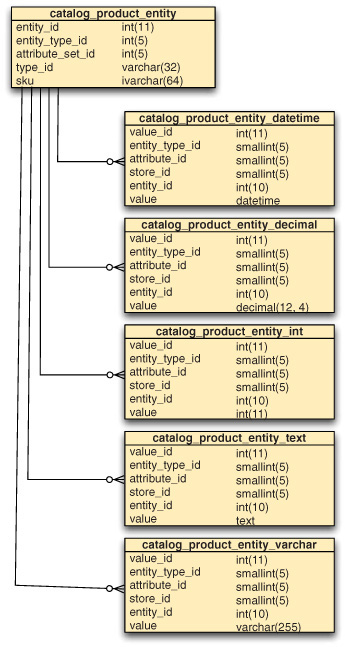

# MongoDB

-------------------------------------------------------------------------------

> MongoDB in Action (2nd edition, 2016), Kyle Banker and Peter Bakkum

-------------------------------------------------------------------------------

## Part 1: Getting Started

+ Además de JavaScript, Ruby es uno de los lenguajes más populares entre los
  usuarios de MongoDB.

### 1. A Database for the Modern Web

+ MongoDB está diseñado para un alto redimiento de lectura y escritura y un
  escalamiento fácil con un manejo de errores automático.
+ MongoDB almacena información como documentos en formato BSON (representación
  binaria de JSON) en lugar de filas.

```
let myDoc = {
    _id:     10,
    name:   "John",
    age:    26,
    email: ["john@gmail.com", "jdoe@gmail.com"]
}
```

> - Para almacenar múltiples emails, en un modelo relacional hubiese sido
>   necesario una tabla de emails con el usuario asociado.
> - El formato JSON es análogo a los *hashmaps* o *dictionaries* en otros
>   lenguajes.

#### MongoDB's key features

+ En lugar de tablas de filas, MongoDB tiene *collections* o coleciones de
  documentos.
+ A diferencia de una base de datos relacional, MongoDB no impone ningún tipo
  de esquema, por lo que es posible que cada documento en una coleción tenga
  una estructura diferente (aunque es aconsejable que sean uniformes).
+ Un modelo de base de datos sin esquema como MongoDB, permite representar
  valores verdaderamente variables que en un modelo relacional se tendría que
  preveer la variabilidad de los valores con la creación de tablas tipo
  *entity-attribute-value*.

Ejemplo de un esquema de modelo relacional:



*Fig 1.2: Una porción del esquema de una aplicación e-commerce que permite la
creación de atributos dinámicos para productos.*

+ MongoDB soporta la creación de múltiples índices secundarios para optimizar
  las consultas, incluido los índices geoespaciales.
+ La replicación en MongoDB, permite que los nodos, uno primario de lectura y
  escritura y el resto secundario de solo lectura, se puedan recuperar ante una
  falla del nodo primario nombrando a otro secundario como primario.
+ El *journaling* en MongoDB, permite descargar cada escritura en un archivo
  cada 100 ms. Esto sirve para restaurar, ante posibles fallos, a un estado
  coherente. Esta función está habilitada por defecto.
+ MongoDB fue diseñado para dar opciones entre velocidad y durabilidad, aunque
  es recomendable tener una configuración segura para datos importantes.
+ El escalamiento en MongoDB puede ser tanto vertical (scaling up) como
  horizontal(scaling out).
+ El escalamiento horizontal en MongoDB, es manejado mediante un sistema de
  fragmentación conocido como *sharding* que se encarga de distribuir los datos
  entre todos los demás nodos.

#### MongoDB's core server and tools

+ mongo: cliente que se conecta a un proceso *mongod* y carga la shell.
+ mongod: proceso o *daemon* principal de la base de datos.
+ mongos: enrutador de consultas para clusters fragmentados.

+ mongodump: guarda (backup) los datos de la base de datos en formato BSON.
+ mongorestore: restaura el backup.
+ mongoimport: importa datos JSON, CSV y TSV con ciertos ajustes previos.
+ mongoexport: exporta los datos en formato JSON, CSV y TSV.

#### Why MongoDB?

+ Adecuado para aplicaciones web debido a su modelo basado en documentos.
+ Permite un desarrollo más ágil ya que es un modelo sin esquema.
+ Ideal para analíticas y *logging* de usuarios.
+ Esquemas variables que permiten manipular directamente los datos obtenidos.

#### Tips and limitations

+ MongoDB necesita ejecutarse en ordenadores de 64 bits para direccionar mayor
  a 4GB de memoria.
+ MongoDB se ejecuta mejor en un servidor dedicado que en uno compartido.
+ El lenguaje de consultas de MongoDB no es tan fácil como SQL, debido a que
  está pensado más para ser embebido en la aplicación y orientado a developers.
+ La ejecución de MongoDB en clústers es mucho más costoso que en otras base de
  datos, debido a que require un cluster de 3 nodos de configuración y maneja
  la replicación con el *sharding* de manera separada.

-------------------------------------------------------------------------------

### 2. MongoDb Through the JavaScript shell

#### Diving into the MongoDB shell

+ Mostrar la lista de DB's existentes: `show databases`.
+ Crear o seleccionar una DB ya existente: `use test`.
+ Mostrar las *collections* de las DB: `show collections`.

+ Insertar y consultar documentos:

    - Insertar documentos en una colección:
```js
db.users.insert({name: "John"})
db.users.insert({name: "John", lastname: "Doe", age: 28})
```

    - Mostrar los cantidad de documentos en una colección: `db.users.count()`.
    - Mostrar los documentos de una colección:
```js
db.users.find({})                                 // Todos
db.users.find({name: "John", age: 32})            // name == 'John' Y age == 32
db.users.find({$and: [{name: "John"}, {age: 32}]})// name == 'John' Y age == 32
db.users.find({$or: [{name: "John"}, {age: 32}]}) // name == 'John' O age == 32
db.users.find({name: /j.*/i, age: 32})            // Filtro con Regular Exp.
db.users.find({name: "John", age: {$gt: 20})      // name == 'John' Y age > 20
db.users.find({name: "John", age: {$lt: 20})      // name == 'John' Y age < 20
db.users.find({name: "John", age: {$lte: 20})     // name == 'John' Y age <= 20
```

+ Actualizar documentos:

    - Actualizar o agregar/remover propiedades con `$set`:
```js
.db.users.update({name: "John"}, {$set {lastname: "Newdoe"}})   // Actualiza
.db.users.update({name: "John"}, {$set {sex: "male"}})          // Agrega
.db.users.update({name: "John"}, {$unset {lastname: 1}})        // Remueve
```

    - Reemplazar el primer documento por el segundo especificado:
```js
.db.users.update({name: "John"}, {lastname: "Newdoe"})          // Reemplaza
```

> - Una base de datos o *collection* en MongoDB, solo son creados cuando tiene
>   documentos insertados.
> - Si no se especifica MongoDB crea automáticamente valores para el `_id` de
>   cada documento, lo que viene a ser como la clave primaria de este.
> - La diferencia entre un `update()` con el operador `$set` y sin el, es que
>   el primero agrega un nuevo campo o actualiza su valor, mientras que el
>   *update* sin `$set` reemplaza todo el documento por el documento
>   especificado en el segundo parámetro.

### 3. Writing Programs using MongoDB

## Part 2: Application Development in MongoDB
## Part 3: MongoDB Mastery
## Apendix A:
Instalación (linux):
```
pamac build mongo-bin
```
